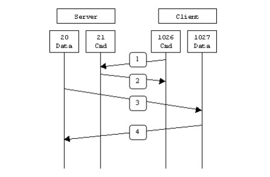
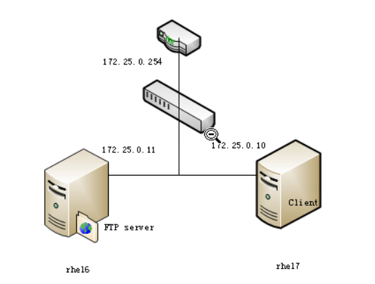
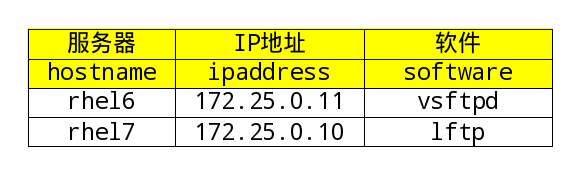
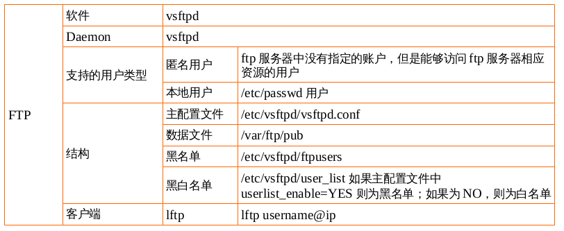

## FTP文件共享服务

[TOC]

---

> 课程要求
1. 设置vsftpd服务匿名用户能够对/var/ftp/pub/目录有上传下载的权限。
2. 系统用户能够访问家目录，上传下载删除
3. 除了系统用户student有chroot的权限，其他系统用户没有chroot的权限

### FTP服务

FTP 是File Transfer Protocol（文件传输协议）的英文简称，而中文简称为“文传协议”。用于
Internet上的控制文件的双向传输。同时，它也是一个应用程序（Application）。基于不同的操作系统有
不同的FTP应用程序，而所有这些应用程序都遵守同一种协议以传输文件。在FTP的使用当中，用户经常遇到两
个概念："下载"（Download）和"上传"（Upload）。"下载"文件就是从远程主机拷贝文件至自己的计算机
上；"上传"文件就是将文件从自己的计算机中拷贝至远程主机上。用Internet语言来说，用户可通过客户机程
序向（从）远程主机上传（下载）文件。

### FTP原理

FTP只通过TCP连接,没有用于FTP的UDP组件。

FTP不同于其他服务的是它使用了两个端口, 一个数据端口和一个命令端口(或称为控制端口)。

通常21端口是命令端口，20端口是数据端口。当混入主动/被动模式的概念时，数据端口就有可能不是20了。

**工作模式** FTP支持两种模式：
* Standard (PORT方式，主动方式)
* Passive (PASV，被动方式)。

**Port模式**

主动模式下，FTP客户端从任意的非特殊的端口（N > 1023）连入到FTP服务器的命令端口--21端口。然后客户端在N+1（N+1 >= 1024）端口监听，并且通过N+1（N+1 >= 1024）端口发送命令给FTP服务器。服务器会反过来连接用户本地指定的数据端口，比如20端口。

以服务器端防火墙为立足点，要支持主动模式FTP需要打开如下交互中使用到的端口：

*  FTP服务器命令（21）端口接受客户端任意端口（客户端初始连接）
*  FTP服务器命令（21）端口到客户端端口（>1023）（服务器响应客户端命令）
*  FTP服务器数据（20）端口到客户端端口（>1023）（服务器初始化数据连接到客户端数据端口）
*  FTP服务器数据（20）端口接受客户端端口（>1023）（客户端发送ACK包到服务器的数据端口）

用图表示如下：



在第1步中，客户端的命令端口与FTP服务器的命令端口建立连接，并发送命令“PORT 1027”。然后在第2步中，FTP服务器给客户端的命令端口返回一个"ACK"。在第3步中，FTP服务器发起一个从它自己的数据端口（20）到客户端先前指定的数据端口（1027）的连接，最后客户端在第4步中给服务器端返回一个"ACK"。

主动方式FTP的主要问题实际上在于客户端。FTP的客户端并没有实际建立一个到服务器数据端口的连接，它只是简单的告诉服务器自己监听的端口号，服务器再回来连接客户端这个指定的端口。对于客户端的防火墙来说，这是从外部系统建立到内部客户端的连接，这是通常会被阻塞的。

**Passive模式**

为了解决服务器发起到客户的连接的问题，人们开发了一种不同的FTP连接方式。这就是所谓的被动方式，或者叫做PASV，当客户端通知服务器它处于被动模式时才启用。

在被动方式FTP中，命令连接和数据连接都由客户端，这样就可以解决从服务器到客户端的数据端口的入方向连接被防火墙过滤掉的问题。当开启一个FTP连接时，客户端打开两个任意的非特权本地端口（N >; 1024和N+1）。第一个端口连接服务器的21端口，但与主动方式的FTP不同，客户端不会提交PORT命令并允许服务器来回连它的数据端口，而是提交PASV命令。这样做的结果是服务器会开启一个任意的非特权端口（P >; 1024），并发送PORT P命令给客户端。然后客户端发起从本地端口N+1到服务器的端口P的连接用来传送数据。

对于服务器端的防火墙来说，必须允许下面的通讯才能支持被动方式的FTP:

*  FTP服务器命令（21）端口接受客户端任意端口（客户端初始连接）
*  FTP服务器命令（21）端口到客户端端口（>1023）（服务器响应客户端命令）
*  FTP服务器数据端口（>1023）接受客户端端口（>1023）（客户端初始化数据连接到服务器指定的任意端口）
*  FTP服务器数据端口（>1023）到客户端端口（>1023）（服务器发送ACK响应和数据到客户端的数据端口）

用图表示如下：


在第1步中，客户端的命令端口与服务器的命令端口建立连接，并发送命令“PASV”。然后在第2步中，服务器返回命令"PORT 2024"，告诉客户端（服务器）用哪个端口侦听数据连接。在第3步中，客户端初始化一个从自己的数据端口到服务器端指定的数据端口的数据连接。最后服务器在第4 步中给客户端的数据端口返回一个"ACK"响应。

被动方式的FTP解决了客户端的许多问题，但同时给服务器端带来了更多的问题。最大的问题是需要允许从任意远程终端到服务器高位端口的连接。幸运的是，许多FTP守护程序，包括流行的WU-FTPD允许管理员指定FTP服务器使用的端口范围。详细内容参看附录1。

第二个问题是客户端有的支持被动模式，有的不支持被动模式，必须考虑如何能支持这些客户端，以及为他们提供解决办法。例如，Solaris提供的FTP命令行工具就不支持被动模式，需要第三方的FTP客户端，比如ncftp。

随着WWW的广泛流行，许多人习惯用web浏览器作为FTP客户端。大多数浏览器只在访问ftp://这样的URL时才支持被动模式。这到底是好还是坏取决于服务器和防火墙的配置。


下面的图表会帮助管理员们记住每种FTP方式是怎样工作的：

**主动FTP：**
1.   命令连接：客户端 >1023端口 -> 服务器 21端口
2.   数据连接：客户端 >1023端口 <- 服务器 20端口

**被动FTP：**
1.   命令连接：客户端 >1023端口 -> 服务器 21端口
2.   数据连接：客户端 >1023端口 -> 服务器 >1023端口

下面是主动与被动FTP优缺点的简要总结：

主动FTP对FTP服务器的管理有利，但对客户端的管理不利。因为FTP服务器企图与客户端的高位随机端口建立连接，而这个端口很有可能被客户端的防火墙阻塞掉。被动FTP对FTP客户端的管理有利，但对服务器端的管理不利。因为客户端要与服务器端建立两个连接，其中一个连到一个高位随机端口，而这个端口很有可能被服务器端的防火墙阻塞掉。

幸运的是，有折衷的办法。既然FTP服务器的管理员需要他们的服务器有最多的客户连接，那么必须得支持被动FTP。我们可以通过为FTP服务器指定一个有限的端口范围来减小服务器高位端口的暴露。这样，不在这个范围的任何端口会被服务器的防火墙阻塞。虽然这没有消除所有针对服务器的危险，但它大大减少了危险。


### VSFTPD 软件

如果你想在你的Linux/Unix服务器上搭建一个安全、高性能、稳定性好的FTP服务器，那么vsftpd可能是你的首选应用。vsftpd意思为“very secure FTP daemon(非常安全的FTP进程)”，是一个基于GPL发布的类UNIX类操作系统上运行的服务器的名字（是一种守护进程），可以运行在诸如Linux、BSD、Solaris、HP-UX以及Irix等系统上面。vsftpd支持很多其他传统的FTP服务器不支持的良好特性。

最新的vsftpd版本可在其官网获取：[www.vsftpd.org](www.vsftpd.org)

vsftpd 是“very secure FTP daemon”的缩写，安全性是它的一个最大的特点。vsftpd 是一个 UNIX 类操作系统上运行的服务器的名字，它可以运行在诸如 Linux、BSD、Solaris、 HP-UNIX等系统上面，是一个完全免费的、开发源代码的ftp服务器软件，支持很多其他的 FTP 服务器所不支持的特征。比如：非常高的安全性需求、带宽限制、良好的可伸缩性、可创建虚拟用户、支持IPv6、速率高等。

看看都有哪些网站在使用vsftpd吧：

```shell
    ftp.RedHat.com
    ftp.SUSE.com
    ftp.debian.org
    ftp.openbsd.org
    ftp.freebsd.org
    ftp.gnu.org
    ftp.gnome.org
    ftp.kde.org
    ftp.kernel.org
    rpmfind.net
    ftp.linux.org.uk
    ftp.gimp.org
    ftp-stud.fht-esslingen.de
    gd.tuwien.ac.at
    ftp.sunet.se
    ftp.ximian.com
    ftp.engardelinux.org
    ftp.sunsite.org.uk
    ftp.isc.org
```

#### 什么是vsftpd

Vsftpd是一种在GPL许可下开放源代码的FTP服务器，用于多种UNIX系统和Linux系统。Vsftpd也称为Very Secure FTP Daemon，它是一种安全、快速、稳定的FTP服务器，能够高效地处理大量的并发连接。

Vsftpd的主要特点包括：

* 提供安全的体系结构，根据任务的最低特权需求单独执行每个任务。
* 支持虚拟IP配置，可以在提供一个IP地址的情况下，在域中用该地址建立多个FTP服务器。
* 允许配置并使用虚拟用户，从而与系统用户账户分离。
* 支持TCP封装。
* 允许配置匿名服务器，用户可以在不需要身份验证的情况下上传和下载文件。
* 性能稳定，可以处理大量的并发连接。
* 可以配置为独立的服务器。
* Vsftpd服务器支持带宽控制。

> 用户类型

**r 真实用户**

这类用户是指在FTP服务上拥有帐号，即/etc/passwd里的用户。当这类用户登录FTP服务器的时候，其默认的主目录就是其帐号命名的目录。但是，其还可以变更到其他目录中去。如系统的主目录等等。

**g 来宾用户**

在vsFTP软件里没有这类用户，但是在FTP服务器中有，我们往往会给不同的部门或者某个特定的用户设置一个帐户。但是，这个账户有个特点，就是其只能够访问自己的主目录。服务器通过这种方式来保障FTP服务上其他文件的安全性。这类帐户，在Vsftpd软件中就叫做Guest用户。拥有这类用户的帐户，只能够访问其主目录下的目录，而不得访问主目录以外的文件。

**a 匿名用户**

Anonymous（匿名）用户，这也是我们通常所说的匿名访问。这类用户是指在FTP服务器中没有指定帐户，但是其仍然可以进行匿名访问某些公开的资源。
在组建FTP服务器的时候，我们就需要根据用户的类型，对用户进行归类。默认情况下，Vsftpd服务器会把建立的所有帐户都归属为Real用户。但是，这往往不符合企业安全的需要。因为这类用户不仅可以访问自己的主目录，而且，还可以访问其他用户的目录。这就给其他用户所在的空间带来一定的安全隐患。所以，企业要根据实际情况，修改用户所在的类别。

---

#### 项目实践1: 设置vsftpd服务匿名用户能够对/var/ftp/pub/目录有上传下载的权限

##### 实验准备阶段

1. 网络拓扑图
2. 规划软件安装
3. 修改配置文件
4. 启动服务
5. 注意防火墙关闭
6. 客户端测试服务		

> 网络拓扑图



> 规划软件安装




##### 具体步骤

Linux几乎所有的发行版本都内置了Vsftpd服务。

**服务器端rhel6**

```shell
[root@rhel6 ~]# yum install -y vsftpd
Loaded plugins: product-id, refresh-packagekit, security, subscription-manager
This system is not registered to Red Hat Subscription Management. You can use subscription-manager to register.
Setting up Install Process
Resolving Dependencies
--> Running transaction check
---> Package vsftpd.x86_64 0:2.2.2-11.el6_4.1 will be installed
--> Finished Dependency Resolution

Dependencies Resolved

=============================================================================================
 Package            Arch               Version                      Repository          Size
=============================================================================================
Installing:
 vsftpd             x86_64             2.2.2-11.el6_4.1             server             151 k

Transaction Summary
=============================================================================================
Install       1 Package(s)

Total download size: 151 k
Installed size: 331 k
Downloading Packages:
vsftpd-2.2.2-11.el6_4.1.x86_64.rpm                                    | 151 kB     00:00     
Running rpm_check_debug
Running Transaction Test
Transaction Test Succeeded
Running Transaction
  Installing : vsftpd-2.2.2-11.el6_4.1.x86_64                                            1/1
  Verifying  : vsftpd-2.2.2-11.el6_4.1.x86_64                                            1/1

Installed:
  vsftpd.x86_64 0:2.2.2-11.el6_4.1                                                           

Complete!

[root@rhel6 ~]# service iptables stop
iptables: Setting chains to policy ACCEPT: filter          [  OK  ]
iptables: Flushing firewall rules:                         [  OK  ]
iptables: Unloading modules:                               [  OK  ]

[root@rhel6 ~]# getenforce
Enforcing

[root@rhel6 ~]# rpm -q vsftpd
vsftpd-2.2.2-11.el6_4.1.x86_64
[root@rhel6 ~]# rpm -ql vsftpd
/etc/logrotate.d/vsftpd
/etc/pam.d/vsftpd
/etc/rc.d/init.d/vsftpd
/etc/vsftpd
/etc/vsftpd/ftpusers
/etc/vsftpd/user_list
/etc/vsftpd/vsftpd.conf
/etc/vsftpd/vsftpd_conf_migrate.sh
/usr/sbin/vsftpd
/usr/share/doc/vsftpd-2.2.2
/usr/share/doc/vsftpd-2.2.2/AUDIT
/usr/share/doc/vsftpd-2.2.2/BENCHMARKS
/usr/share/doc/vsftpd-2.2.2/BUGS
/usr/share/doc/vsftpd-2.2.2/COPYING
/usr/share/doc/vsftpd-2.2.2/Changelog
/usr/share/doc/vsftpd-2.2.2/EXAMPLE
/usr/share/doc/vsftpd-2.2.2/EXAMPLE/INTERNET_SITE
/usr/share/doc/vsftpd-2.2.2/EXAMPLE/INTERNET_SITE/README
/usr/share/doc/vsftpd-2.2.2/EXAMPLE/INTERNET_SITE/README.configuration
/usr/share/doc/vsftpd-2.2.2/EXAMPLE/INTERNET_SITE/vsftpd.conf
/usr/share/doc/vsftpd-2.2.2/EXAMPLE/INTERNET_SITE/vsftpd.xinetd
/usr/share/doc/vsftpd-2.2.2/EXAMPLE/INTERNET_SITE_NOINETD
/usr/share/doc/vsftpd-2.2.2/EXAMPLE/INTERNET_SITE_NOINETD/README
/usr/share/doc/vsftpd-2.2.2/EXAMPLE/INTERNET_SITE_NOINETD/README.configuration
/usr/share/doc/vsftpd-2.2.2/EXAMPLE/INTERNET_SITE_NOINETD/vsftpd.conf
/usr/share/doc/vsftpd-2.2.2/EXAMPLE/PER_IP_CONFIG
/usr/share/doc/vsftpd-2.2.2/EXAMPLE/PER_IP_CONFIG/README
/usr/share/doc/vsftpd-2.2.2/EXAMPLE/PER_IP_CONFIG/README.configuration
/usr/share/doc/vsftpd-2.2.2/EXAMPLE/PER_IP_CONFIG/hosts.allow
/usr/share/doc/vsftpd-2.2.2/EXAMPLE/README
/usr/share/doc/vsftpd-2.2.2/EXAMPLE/VIRTUAL_HOSTS
/usr/share/doc/vsftpd-2.2.2/EXAMPLE/VIRTUAL_HOSTS/README
/usr/share/doc/vsftpd-2.2.2/EXAMPLE/VIRTUAL_USERS
/usr/share/doc/vsftpd-2.2.2/EXAMPLE/VIRTUAL_USERS/README
/usr/share/doc/vsftpd-2.2.2/EXAMPLE/VIRTUAL_USERS/README.configuration
/usr/share/doc/vsftpd-2.2.2/EXAMPLE/VIRTUAL_USERS/logins.txt
/usr/share/doc/vsftpd-2.2.2/EXAMPLE/VIRTUAL_USERS/vsftpd.conf
/usr/share/doc/vsftpd-2.2.2/EXAMPLE/VIRTUAL_USERS/vsftpd.pam
/usr/share/doc/vsftpd-2.2.2/EXAMPLE/VIRTUAL_USERS_2
/usr/share/doc/vsftpd-2.2.2/EXAMPLE/VIRTUAL_USERS_2/README
/usr/share/doc/vsftpd-2.2.2/FAQ
/usr/share/doc/vsftpd-2.2.2/INSTALL
/usr/share/doc/vsftpd-2.2.2/LICENSE
/usr/share/doc/vsftpd-2.2.2/README
/usr/share/doc/vsftpd-2.2.2/README.security
/usr/share/doc/vsftpd-2.2.2/REWARD
/usr/share/doc/vsftpd-2.2.2/SECURITY
/usr/share/doc/vsftpd-2.2.2/SECURITY/DESIGN
/usr/share/doc/vsftpd-2.2.2/SECURITY/IMPLEMENTATION
/usr/share/doc/vsftpd-2.2.2/SECURITY/OVERVIEW
/usr/share/doc/vsftpd-2.2.2/SECURITY/TRUST
/usr/share/doc/vsftpd-2.2.2/SIZE
/usr/share/doc/vsftpd-2.2.2/SPEED
/usr/share/doc/vsftpd-2.2.2/TODO
/usr/share/doc/vsftpd-2.2.2/TUNING
/usr/share/doc/vsftpd-2.2.2/vsftpd.xinetd
/usr/share/man/man5/vsftpd.conf.5.gz
/usr/share/man/man8/vsftpd.8.gz
/var/ftp
/var/ftp/pub

[root@rhel6 ~]# service vsftpd start
Starting vsftpd for vsftpd:                                [  OK  ]
[root@rhel6 ~]# netstat -luntp|grep vsftpd
tcp        0      0 0.0.0.0:21                  0.0.0.0:*                   LISTEN      2940/vsftpd
```

**客户端 rhel7**

```shell
[root@rhel7 ~]# yum install -y lftp
Loaded plugins: langpacks, product-id, subscription-manager
This system is not registered to Red Hat Subscription Management. You can use subscription-manager to register.
server                                                                | 4.1 kB  00:00:00     
(1/2): server/group_gz                                                | 134 kB  00:00:00     
(2/2): server/primary_db                                              | 3.4 MB  00:00:00     
Resolving Dependencies
--> Running transaction check
---> Package lftp.x86_64 0:4.4.8-3.el7 will be installed
--> Finished Dependency Resolution

Dependencies Resolved

=============================================================================================
 Package           Arch                Version                     Repository           Size
=============================================================================================
Installing:
 lftp              x86_64              4.4.8-3.el7                 server              749 k

Transaction Summary
=============================================================================================
Install  1 Package

Total download size: 749 k
Installed size: 2.4 M
Downloading packages:
lftp-4.4.8-3.el7.x86_64.rpm                                           | 749 kB  00:00:00     
Running transaction check
Running transaction test
Transaction test succeeded
Running transaction
  Installing : lftp-4.4.8-3.el7.x86_64                                                   1/1
server/productid                                                      | 1.6 kB  00:00:00     
  Verifying  : lftp-4.4.8-3.el7.x86_64                                                   1/1

Installed:
  lftp.x86_64 0:4.4.8-3.el7                                                                  

Complete!
[root@rhel7 ~]# systemctl stop firewalld
[root@rhel7 ~]# getenforce
Enforcing

[root@rhel7 ~]# rpm -ql lftp
/etc/lftp.conf
/usr/bin/lftp
/usr/bin/lftpget
/usr/lib64/lftp
/usr/lib64/lftp/4.4.8
/usr/lib64/lftp/4.4.8/cmd-mirror.so
/usr/lib64/lftp/4.4.8/cmd-sleep.so
/usr/lib64/lftp/4.4.8/cmd-torrent.so
/usr/lib64/lftp/4.4.8/liblftp-network.so
/usr/lib64/lftp/4.4.8/liblftp-pty.so
/usr/lib64/lftp/4.4.8/proto-file.so
/usr/lib64/lftp/4.4.8/proto-fish.so
/usr/lib64/lftp/4.4.8/proto-ftp.so
/usr/lib64/lftp/4.4.8/proto-http.so
/usr/lib64/lftp/4.4.8/proto-sftp.so
/usr/lib64/liblftp-jobs.so.0
/usr/lib64/liblftp-jobs.so.0.0.0
/usr/lib64/liblftp-tasks.so.0
/usr/lib64/liblftp-tasks.so.0.0.0
/usr/share/doc/lftp-4.4.8
/usr/share/doc/lftp-4.4.8/BUGS
/usr/share/doc/lftp-4.4.8/COPYING
/usr/share/doc/lftp-4.4.8/ChangeLog
/usr/share/doc/lftp-4.4.8/FAQ
/usr/share/doc/lftp-4.4.8/FEATURES
/usr/share/doc/lftp-4.4.8/NEWS
/usr/share/doc/lftp-4.4.8/README
/usr/share/doc/lftp-4.4.8/README.debug-levels
/usr/share/doc/lftp-4.4.8/README.dnssec
/usr/share/doc/lftp-4.4.8/README.modules
/usr/share/doc/lftp-4.4.8/THANKS
/usr/share/doc/lftp-4.4.8/TODO
/usr/share/locale/cs/LC_MESSAGES/lftp.mo
/usr/share/locale/de/LC_MESSAGES/lftp.mo
/usr/share/locale/es/LC_MESSAGES/lftp.mo
/usr/share/locale/fr/LC_MESSAGES/lftp.mo
/usr/share/locale/it/LC_MESSAGES/lftp.mo
/usr/share/locale/ja/LC_MESSAGES/lftp.mo
/usr/share/locale/ko/LC_MESSAGES/lftp.mo
/usr/share/locale/pl/LC_MESSAGES/lftp.mo
/usr/share/locale/pt_BR/LC_MESSAGES/lftp.mo
/usr/share/locale/ru/LC_MESSAGES/lftp.mo
/usr/share/locale/zh_CN/LC_MESSAGES/lftp.mo
/usr/share/locale/zh_HK/LC_MESSAGES/lftp.mo
/usr/share/locale/zh_TW/LC_MESSAGES/lftp.mo
/usr/share/man/man1/lftp.1.gz
/usr/share/man/man1/lftpget.1.gz
/usr/share/man/man5/lftp.conf.5.gz
```

> 1.从客户端以匿名用户来访问ftp服务

```shell
[root@rhel7 ~]# lftp 172.25.0.11
lftp 172.25.0.11:~> cd pub
cd ok, cwd=/pub
lftp 172.25.0.11:/pub> ls
lftp 172.25.0.11:/pub> put rhel7
put: Access failed: 550 Permission denied. (rhel7)
```

**当前的情况**

匿名用户能够访问/var/ftp/pub，能够查看文件内容，能够下载；不能上传文件,不能删除文件。

**问题的解决**

报错550，没有权限上传文件

我们要分析权限有哪些？

1. vsftpd的配置文件
2. UGO、特殊、隐藏、ACL、
3. SELINUX

**1.修改主配置文件**

```shell
vim /etc/vsftpd/vsftpd.conf
anon_upload_enable=YES
```

**2./var/ftp/pub 目录o-rwx**

```shell
[root@rhel6 pub]# ll -d /var/ftp/pub
drwxr-xrwx. 2 root root 4096 Aug  3 10:35 /var/ftp/pub
```

**3.测试**

```shell
lftp 172.25.0.11:/pub> put rhel7
put: Access failed: 553 Could not create file. (rhel7)
```

目前修改了配置文件和ugo权限还是报错553，不能create file

我们分析一下，只有selinux的权限问题了

**4.SELINUX**

如何确定是否是selinux的原因，可以通过以下步骤：

* 1)先关闭selinux，测试ok的
* 2)开启selinux，测试no的

我们需要去分析selinux的记录，分析工具是`sealert`,由`setroubleshoot`软件安装。

1. 查看当前系统中是否有sealert工具	`which sealert`
2. 安装setroubleshoot		`yum install -y setroubleshoot`
3. 分析selinux记录		`sealert -a /var/log/audit/audit.log`

```shell
		*****  Plugin allow_anon_write (53.1 confidence) suggests  *******************

		If you want to allow /usr/sbin/vsftpd to be able to write to shared public content
		Then you need to change the label on pub to public_content_rw_t, and potentially turn on the
		allow_httpd_sys_script_anon_write boolean.
		Do
		# semanage fcontext -a -t public_content_rw_t pub
		# restorecon -R -v pub
		# setsebool -P allow_ftpd_anon_write 1

		[root@rhel6 pub]# semanage fcontext -a -t public_content_rw_t /var/ftp/pub
		[root@rhel6 pub]# restorecon -R -v /var/ftp/pub
		[root@rhel6 pub]# ll -Zd /var/ftp/pub
		drwxr-xrwx. root root system_u:object_r:public_content_rw_t:s0 /var/ftp/pub
```

**5.再测试**

```shell
lftp 172.25.0.11:/pub> put rhel7
lftp 172.25.0.11:/pub> ls
-rw-------    1 14       50              0 Aug 03 05:53 rhel7
lftp 172.25.0.11:/pub> exit
```

此时，我们发现匿名用户已经可以成功地对/var/ftp/pub目录进行上传下载了！

---

#### 项目实践2: 真实用户（系统用户）能够访问家目录，上传下载删除

在项目实践1的基础上完成。


**服务端 rhel6**

```shell
[root@rhel6 ftp]# id student
uid=500(student) gid=500(student) groups=500(student)
[root@rhel6 ftp]# passwd student
Changing password for user student.
New password:
BAD PASSWORD: it is based on a dictionary word
Retype new password:
passwd: all authentication tokens updated successfully.

[root@rhel6 ftp]# su - student
[student@rhel6 ~]$ pwd
/home/student
[student@rhel6 ~]$ touch file1
[student@rhel6 ~]$ echo aaa > file1
```

**客户端 rhel7**

```shell
[root@rhel7 ~]# lftp student@172.25.0.11
Password:
lftp student@172.25.0.11:~> ls      
ls: Login failed: 500 OOPS: cannot change directory:/home/student
```

**当前的情况** 系统用户student不能访问家目录。

**问题的解决**

报错500，没有权限进入用户家目录

配置文件没有问题，ugo权限没有问题，只剩下selinux，需要分析

**1.分析selinux**

```shell
# 服务器端
[root@rhel6 ftp]# sealert -a /var/log/audit/audit.log

*****  Plugin catchall_boolean (47.5 confidence) suggests  *******************

If you want to allow ftp to read and write files in the user home directories
Then you must tell SELinux about this by enabling the 'ftp_home_dir'boolean.
Do
setsebool -P ftp_home_dir 1
```

**2.修改布尔值**

```shell
[root@rhel6 ftp]# setsebool -P ftp_home_dir 1
```

**3.测试**

```shell
# 客户端
lftp student@172.25.0.11:~> ls
lftp student@172.25.0.11:~> pwd  
ftp://student@172.25.0.11/%2Fhome/student
lftp student@172.25.0.11:~> ls
-rw-rw-r--    1 500      500             4 Aug 03 07:13 file1
lftp student@172.25.0.11:~> cat file1
aaa
4 bytes transferred
lftp student@172.25.0.11:~> get file1
4 bytes transferred
lftp student@172.25.0.11:~> put
.ICEauthority  .bashrc	 .dbus/     .tcshrc	Music/	    Videos/		  rhel7
.bash_history  .cache/	 .esd_auth  Desktop/	Pictures/   anaconda-ks.cfg	  test1
.bash_logout   .config/  .local/    Documents/	Public/     file1
.bash_profile  .cshrc	 .ssh/	    Downloads/	Templates/  initial-setup-ks.cfg
lftp student@172.25.0.11:~> put rhel7
lftp student@172.25.0.11:~> ls
-rw-rw-r--    1 500      500             4 Aug 03 07:13 file1
-rw-r--r--    1 500      500             0 Aug 03 07:13 rhel7
lftp student@172.25.0.11:~> rm file1
rm ok, \`file1\' removed
lftp student@172.25.0.11:~> ls
-rw-r--r--    1 500      500             0 Aug 03 07:13 rhel7
```

系统用户已经可以实现能够访问家目录，并且能够下载、上传、删除了！


---
#### 项目实践3: 除了系统用户student有chroot的权限，其他系统用户没有chroot的权限

* 匿名用户的根目录	/var/ftp/
* 系统用户的根目录	/home/student/

||chroot_local_user=YES	|    chroot_local_user=NO|
|:--|:--|:--|
|chroot_list_enable=YES		|不能换根，有例外|		都能换根，有例外|		
|chroot_list_enable=NO		|不能换根，没例外|		都能换根，没例外|

如果指定 `chroot_list_enable=YES` 则需要指定文件位置 `chroot_list_file=/etc/vsftpd/chroot_list`


```shell
[root@rhel7 ~]# lftp batman@172.25.0.11
Password:
lftp batman@172.25.0.11:~> ls       
lftp batman@172.25.0.11:~> cd /tmp
cd ok, cwd=/tmp
lftp batman@172.25.0.11:/tmp> pwd
ftp://batman@172.25.0.11/%2Ftmp
lftp batman@172.25.0.11:/tmp> exit
```

**当前的情况** 所有的系统用户都能够chroot，而要求除了student用户之外的所有系统用户都不能chroot。

**解决方法**

可以选择`不能换根，有例外`

**1.修改配置文件**

```shell
# 服务器端
[root@rhel6 ~]# vim /etc/vsftpd/vsftpd.conf
chroot_local_user=YES
chroot_list_enable=YES
chroot_list_file=/etc/vsftpd/chroot_list
```

**2.创建chroot_list**

```shell
[root@rhel6 ~]# vim /etc/vsftpd/chroot_list
[root@rhel6 ~]# cat /etc/vsftpd/chroot_list
student
```

**3.重启服务**

```shell
[root@rhel6 ~]# service vsftpd restart
Shutting down vsftpd:                                      [  OK  ]
Starting vsftpd for vsftpd:                                [  OK  ]
```

**2.测试**

```shell
# 客户端    
[root@rhel7 ~]# lftp batman@172.25.0.11
Password:
lftp batman@172.25.0.11:~> cd /etc/
cd: Access failed: 550 Failed to change directory. (/etc)
lftp batman@172.25.0.11:/> exit
[root@rhel7 ~]# lftp student@172.25.0.11
Password:
lftp student@172.25.0.11:~> cd /etc
cd ok, cwd=/etc                  
lftp student@172.25.0.11:/etc> exit
```

**当前的情况**

系统用户student可以切换根目录，而batman不在chroot_list文件中所以不能切换根目录。


##### 拓展内容

**为什么root用户不能通过ftp协议访问服务器？**

```shell
[root@rhel7 ~]# lftp root@172.25.0.11
Password:
lftp root@172.25.0.11:~> ls         
ls: Login failed: 530 Permission denied.
```

因为有用户访问控制列表`/etc/vsftpd/user_list`

```shell
[root@rhel6 ~]# grep userlist_enable /etc/vsftpd/vsftpd.conf
userlist_enable=YES

[root@rhel6 ftp]# cat /etc/vsftpd/user_list
# vsftpd userlist
# If userlist_deny=NO, only allow users in this file
# If userlist_deny=YES (default), never allow users in this file, and
# do not even prompt for a password.
# Note that the default vsftpd pam config also checks /etc/vsftpd/ftpusers
# for users that are denied.
root
bin
daemon
adm
lp
sync
shutdown
halt
mail
news
uucp
operator
games
nobody
```


---

#### 了解vsftpd的配置文件

|配置文件|说明|
|:--|:--|
|/etc/vsftpd/vsftpd.conf|主配置文件|
|/usr/sbin/vsftpd|Vsftpd的主程序|
|/etc/rc.d/init.d/vsftpd|启动脚本|
|/etc/pam.d/vsftpd|PAM认证文件（此文件中file=/etc/vsftpd/ftpusers字段，指明阻止访问的用户来自/etc/vsftpd/ftpusers文件中的用户）|
|/etc/vsftpd/ftpusers|禁止使用vsftpd的用户列表文件。记录不允许访问FTP服务器的用户名单，管理员可以把一些对系统安全有威胁的用户账号记录在此文件中，以免用户从FTP登录后获得大于上传下载操作的权利，而对系统造成损坏。|
|/etc/vsftpd/user_list|禁止或允许使用vsftpd的用户列表文件。这个文件中指定的用户缺省情况（即在/etc/vsftpd/vsftpd.conf中设置userlist_deny=YES）下也不能访问FTP服务器，在设置了userlist_deny=NO时,仅允许user_list中指定的用户访问FTP服务器。|
|/var/ftp|匿名用户主目录；本地用户主目录为：/home/用户主目录，即登录后进入自己家目录|
|/var/ftp/pub|匿名用户的下载目录，此目录需赋权根chmod 1777 pub（1为特殊权限，使上载后无法删除）|
|/etc/logrotate.d/vsftpd.log|Vsftpd的日志文件|

##### vsftpd的主配置文件/etc/vsftpd/vsftpd.conf说明

和Linux系统中的大多数配置文件一样，vsftpd的配置文件中以#开始注释。

```shell
是否允许匿名登录FTP服务器，默认设置为YES允许
# 用户可使用用户名ftp或anonymous进行ftp登录，口令为用户的E-mail地址。
# 如不允许匿名访问则设置为NO
anonymous_enable=YES
# 是否允许本地用户(即linux系统中的用户帐号)登录FTP服务器，默认设置为YES允许
# 本地用户登录后会进入用户主目录，而匿名用户登录后进入匿名用户的下载目录/var/ftp/pub
# 若只允许匿名用户访问，前面加上#注释掉即可阻止本地用户访问FTP服务器
local_enable=YES
# 是否允许本地用户对FTP服务器文件具有写权限，默认设置为YES允许
write_enable=YES
# 掩码，本地用户默认掩码为077
# 你可以设置本地用户的文件掩码为缺省022，也可根据个人喜好将其设置为其他值
#local_umask=022
# 是否允许匿名用户上传文件，须将全局的write_enable=YES。默认为YES
#anon_upload_enable=YES
# 是否允许匿名用户创建新文件夹
#anon_mkdir_write_enable=YES
# 是否激活目录欢迎信息功能
# 当用户用CMD模式首次访问服务器上某个目录时，FTP服务器将显示欢迎信息
# 默认情况下，欢迎信息是通过该目录下的.message文件获得的
# 此文件保存自定义的欢迎信息，由用户自己建立
#dirmessage_enable=YES
# 是否让系统自动维护上传和下载的日志文件
# 默认情况该日志文件为/var/log/vsftpd.log,也可以通过下面的xferlog_file选项对其进行设定
# 默认值为NO
xferlog_enable=YES
# Make sure PORT transfer connections originate from port 20 (ftp-data).
# 是否设定FTP服务器将启用FTP数据端口的连接请求
# ftp-data数据传输，21为连接控制端口
connect_from_port_20=YES
# 设定是否允许改变上传文件的属主，与下面一个设定项配合使用
# 注意，不推荐使用root用户上传文件
#chown_uploads=YES
# 设置想要改变的上传文件的属主，如果需要，则输入一个系统用户名
# 可以把上传的文件都改成root属主。whoever：任何人
#chown_username=whoever
# 设定系统维护记录FTP服务器上传和下载情况的日志文件
# /var/log/vsftpd.log是默认的，也可以另设其它
#xferlog_file=/var/log/vsftpd.log
# 是否以标准xferlog的格式书写传输日志文件
# 默认为/var/log/xferlog，也可以通过xferlog_file选项对其进行设定
# 默认值为NO
#xferlog_std_format=YES
# 以下是附加配置，添加相应的选项将启用相应的设置
# 是否生成两个相似的日志文件
# 默认在/var/log/xferlog和/var/log/vsftpd.log目录下
# 前者是wu_ftpd类型的传输日志，可以利用标准日志工具对其进行分析；后者是vsftpd类型的日志
#dual_log_enable
# 是否将原本输出到/var/log/vsftpd.log中的日志，输出到系统日志
#syslog_enable
# 设置数据传输中断间隔时间，此语句表示空闲的用户会话中断时间为600秒
# 即当数据传输结束后，用户连接FTP服务器的时间不应超过600秒。可以根据实际情况对该值进行修改
#idle_session_timeout=600
# 设置数据连接超时时间，该语句表示数据连接超时时间为120秒，可根据实际情况对其个修改
#data_connection_timeout=120
# 运行vsftpd需要的非特权系统用户，缺省是nobody
#nopriv_user=ftpsecure
# 是否识别异步ABOR请求。
# 如果FTP client会下达“async ABOR”这个指令时，这个设定才需要启用
# 而一般此设定并不安全，所以通常将其取消
#async_abor_enable=YES
# 是否以ASCII方式传输数据。默认情况下，服务器会忽略ASCII方式的请求。
# 启用此选项将允许服务器以ASCII方式传输数据
# 不过，这样可能会导致由"SIZE /big/file"方式引起的DoS攻击
#ascii_upload_enable=YES
#ascii_download_enable=YES
# 登录FTP服务器时显示的欢迎信息
# 如有需要，可在更改目录欢迎信息的目录下创建名为.message的文件，并写入欢迎信息保存后
#ftpd_banner=Welcome to blah FTP service.
# 黑名单设置。如果很讨厌某些email address，就可以使用此设定来取消他的登录权限
# 可以将某些特殊的email address抵挡住。
#deny_email_enable=YES
# 当上面的deny_email_enable=YES时，可以利用这个设定项来规定哪些邮件地址不可登录vsftpd服务器
# 此文件需用户自己创建，一行一个email address即可
#banned_email_file=/etc/vsftpd/banned_emails
# 用户登录FTP服务器后是否具有访问自己目录以外的其他文件的权限
# 设置为YES时，用户被锁定在自己的home目录中，vsftpd将在下面chroot_list_file选项值的位置寻找chroot_list文件
# 必须与下面的设置项配合
#chroot_list_enable=YES
# 被列入此文件的用户，在登录后将不能切换到自己目录以外的其他目录
# 从而有利于FTP服务器的安全管理和隐私保护。此文件需自己建立
#chroot_list_file=/etc/vsftpd/chroot_list
# 是否允许递归查询。默认为关闭，以防止远程用户造成过量的I/O
#ls_recurse_enable=YES
# 是否允许监听。
# 如果设置为YES，则vsftpd将以独立模式运行，由vsftpd自己监听和处理IPv4端口的连接请求
listen=YES
# 设定是否支持IPV6。如要同时监听IPv4和IPv6端口，
# 则必须运行两套vsftpd，采用两套配置文件
# 同时确保其中有一个监听选项是被注释掉的
#listen_ipv6=YES
# 设置PAM外挂模块提供的认证服务所使用的配置文件名，即/etc/pam.d/vsftpd文件
# 此文件中file=/etc/vsftpd/ftpusers字段，说明了PAM模块能抵挡的帐号内容来自文件/etc/vsftpd/ftpusers中
#pam_service_name=vsftpd
# 是否允许ftpusers文件中的用户登录FTP服务器，默认为NO
# 若此项设为YES，则user_list文件中的用户允许登录FTP服务器
# 而如果同时设置了userlist_deny=YES，则user_list文件中的用户将不允许登录FTP服务器，甚至连输入密码提示信息都没有
#userlist_enable=YES/NO
# 设置是否阻扯user_list文件中的用户登录FTP服务器，默认为YES
#userlist_deny=YES/NO
# 是否使用tcp_wrappers作为主机访问控制方式。
# tcp_wrappers可以实现linux系统中网络服务的基于主机地址的访问控制
# 在/etc目录中的hosts.allow和hosts.deny两个文件用于设置tcp_wrappers的访问控制
# 前者设置允许访问记录，后者设置拒绝访问记录。
# 如想限制某些主机对FTP服务器192.168.57.2的匿名访问，编缉/etc/hosts.allow文件，如在下面增加两行命令：
# vsftpd:192.168.57.1:DENY 和vsftpd:192.168.57.9:DENY
# 表明限制IP为192.168.57.1/192.168.57.9主机访问IP为192.168.57.2的FTP服务器
# 此时FTP服务器虽可以PING通，但无法连接
tcp_wrappers=YES
```

除了上述那些基本设定，我们还可以在vsftpd.conf文件中添加更多的安全选项。其中几个常用的如下：

限制最大连接数和传输速率

在FTP服务器的管理中，无论对本地用户还是匿名用户，对于FTP服务器资源的使用都需要进行控控制，避免由于负担过大造成FTP服务器运行异常，可以添加以下配置项对FTP客户机使用FTP服务器资源进行控制：

*    `max_client`设置项 用于设置FTP服务器所允许的最大客户端连接数，值为0时表示不限制。例如`max_client=100`表示FTP服务器的所有客户端最大连接数不超过100个。
*    `max_per_ip`设置项 用于设置对于同一IP地址允许的最大客户端连接数，值为0时表示不限制。例如`max_per_ip=5`表示同一IP地址的FTP客户机与FTP服务器建立的最大连接数不超过5个。
*    `local_max_rate`设置项 用于设置本地用户的最大传输速率，单位为B/s，值为0时表示不限制。例如`local_max_rate=500000`表示FTP服务器的本地用户最大传输速率设置为500KB/s.
*    `anon_max_rate`设置项 用于设置匿名用户的最大传输速率，单位为B/s,值为0表示不限制。例如`ano_max_rate=200000`，表示FTP服务器的匿名用户最大传输速率设置为200KB/s.

指定用户的权限设置

`vsftpd.user_list`文件需要与`vsftpd.conf`文件中的配置项结合来实现对于`vsftpd.user_list`文件中指定用户账号的访问控制：

（1）设置禁止登录的用户账号

当`vsftpd.conf`配置文件中包括以下设置时，`vsftpd.user_list`文件中的用户账号被禁止进行FTP登录：

```shell
userlist_enable=YES
userlist_deny=YES
```

`userlist_enable`设置项设置使用`vsftpd.user_list`文件，`userlist_deny`设置为`YES`表示`vsftpd.user_list`文件用于设置禁止的用户账号。

（2）设置只允许登录的用户账号

当vsftpd.conf配置文件中包括以下设置时，只有`vsftpd.user_list`文件中的用户账号能够进行FTP登录：

```shell
userlist_enable=YES
userlist_deny=NO
```

`userlist_enable`设置项设置使用vsftpd.user_list文件，`userlist _deny`设置为`NO`表示`vsftpd.usre_list`文件用于设置只允许登录的用户账号，文件中未包括的用户账号被禁止FTP登录。

`userlist_deny`和`userlist_enable`选项限制用户登录FTP服务器（使用`userlist_deny`选项和`user_list`文件一起能有效阻止`root,apache,www`等系统用户登录FTP服务器，从而保证FTP服务器的分级安全性）。以下是两个选项的具体表现形式和两种搭配使用方式的效果：

|配置|说明|
|:--|:--|
|Userlist_enable=YES|Ftpusers中用户允许访问;User_list中用户允许访问|
|Userlist_enable=NO|Ftpusers中用户禁止访问;User_list中用户允许访问|
|Userlist_deny=YES|Ftpusers中用户禁止访问（登录时可以看到密码输入提示，但仍无法访问）;user_list 中用户禁止访问|
|Userlist_deny=NO|ftpusers中用户禁止访问;user_list中用户允许访|
|Userlist_enable=YES 并且Userlist_deny=YES|Ftpusers中用户禁止访问;User_list中用户禁止访问（登录时不会出现密码提示，直接被服务器拒绝）|
|Userlist_enable=YES 并且Userlist_deny=NO|Ftpusers中用户禁止访问;User_list中用户允许访问|

修改默认端口

默认FTP服务器端口号是21，出于安全目的，有时需修改默认端口号，修改/etc/vsftpd/vsftpd.conf，添加语句(例)：

`listen_port=4449 `

语句指定了修改后FTP服务器的端口号，应尽量大于4000。修改后访问

`#ftp 192.168.57.2 4449`

注意这里需加上正确的端口号了，否则不能正常连接。

设置用户组

有关FTP用户和用户组的重要性，我们在之前介绍vsftpd的时候便已经提到过。这里主要是简单的说明用户组的技术实现，至于具体如何应用，还是具体需求具体对待。

```shell
mkdir -p /home/try  递归创建新目录
groupadd try        新建组
useradd -g try -d /home/try try1 新建用户try1并指定家目录和属组
useradd -g try -d /home/try try2 新建用户try2并指定家目录和属组
useradd -g try -d /home/try try3 新建用户try3并指定家目录和属组
passwd try1  为新用户设密码
passwd try2  为新用户设密码
passwd try3  为新用户设密码
chown try1 /home/try 设置目录属主为用户try1
chown .try /home/try 设置目录属组为组try
chmod 750 /home/try  设置目录访问权限try1为读，写，执行；try2，try3为读，执行
```

由于本地用户登录FTP服务器后进入自己主目录，而try1,try2 try3对主目录/home/try分配的权限不同，所以通过FTP访问的权限也不同，try1访问权限为：上传，下载，建目录；try2，try3访问权限为下载，浏览，不能建目录和上传。实现了群组中用户不同访问级别，加强了对FTP服务器的分级安全管理。

连接超时（本部分内容由李洋提供）

配置空闲的用户会话的中断时间：如下配置将在用户会话空闲5分钟后被中断，以释放服务器的资源

`Idle_session_timeout=300`

配置空闲的数据连接的中断时间：如下配置将在数据空闲连接1分钟后被中断，同样也是为了释放服务器的资源

`Data_connection_timeout=60`

配置客户端空闲时的自动中断和激活连接的时间：如下配置将使客户端空闲1分钟后自动中断连接，并在30秒后自动激活连接

```shell
Accept_timeout=60
Connect_timeout=30
```

##### vsftpd的日志

常见的vsftpd日志解决方案

在vsftpd.conf中有如下内容定义了日志的记录方式：

```shell
# 表明FTP服务器记录上传下载的情况
xferlog_enable=YES
# 表明将记录的上传下载情况写在xferlog_file所指定的文件中，即xferlog_file选项指定的文件中
xferlog_std_format=YES
xferlog_file=/var/log/xferlog
# 启用双份日志。在用xferlog文件记录服务器上传下载情况的同时，
# vsftpd_log_file所指定的文件，即/var/log/vsftpd.log也将用来记录服务器的传输情况
dual_log_enable=YES
vsftpd_log_file=/var/log/vsftpd.log
```

vsftpd的两个日志文件分析如下：

/var/log/xferlog

记录内容举例

```shell
Thu Sep 6 09:07:48 2007 7 192.168.57.1 4323279 /home/student/phpMyadmin-2.11.0-all-languages.tar.gz b -i r student ftp 0 * c
```

/var/log/vsftpd.log

记录内容举例

```shell
Tue Sep 11 14:59:03 2007 [pid 3460]    CONNECT: Client "127.0.0.1"
Tue Sep 11 14:59:24 2007 [pid 3459] [ftp] OK LOGIN;Client "127.0.0.1" ,anon password ”
```

/var/log/xferlog日志文件中数据的分析和参数说明

|记录数据|参数名称|参数说明|
|Thu Sep 6 09:07:48 2007|当前时间|当前服务器本地时间，格式为： DDD MMM dd hh:mm:ss YYY|
|7|传输时间|传送文件所用时间，单位为秒|
|192.168.57.1|远程主机名称/IP|远程主机名称/IP|
|4323279|文件大小|传送文件的大小，单位为byte|
|/home/student/phpMyadmin-2.11.0-all-languages.tar.gz|文件名|传输文件名，包括路径|
|b|传输类型|传输方式的类型，包括两种：a以ASCII传输 b以二进制文件传输|
|–|特殊处理标志|特殊处理的标志位，可能的值包括：_ 不做任何特殊处理；C 文件是压缩格式；U 文件是非压缩格式；T 文件是tar格式|
|i|传输方向|文件传输方向，包括两种：o 从FTP服务器向客户端传输；i 从客户端向FTP服务器传输|
|r|访问模式|用户访问模式，包括：a 匿名用户；g 来宾用户；r 真实用户，即系统中的用户|
|student|用户名|用户名称|
|ftp|服务名|所使用的服务名称，一般为FTP|
|0|认证方式|认证方式，包括：0 无；1 RFC931认证|
|*|认证用户id|认证用户的id，如果使用*，则表示无法获得该id|
|c|完成状态|传输的状态：c 表示传输已完成；i 表示传输示完成|


##### 常见的FTP命令，以及FTP数字代码的意义

命令格式如下显示：

~~~
FTP命令
  	功能
  	FTP命令
  	功能
~~~

```shell
ls
	显示服务器上的目录
  	ls [remote-dir][local-file]
  	显示远程目录remote-dir，并存入本地文件local-file


get remote-file [local-file]
	从服务器下载指定文件到客户端
  	mget remote-files
  	下载多个远程文件(mget命令允许用通配符下载多个文件)


put local-file [remote-file]
	从客户端上传指定文件到服务器
  	mput local-file
  	将多个文件上传至远程主机(mput命令允许用通配符上传多个文件)


open
	连接FTP服务器
  	mdelete [remote-file]
  	删除远程主机文件


close
	中断与远程服务器的ftp会话（与open对应）
  	mkdir dir-name
  	在远程主机中创建目录


open host[port]
	建立指定的ftp服务器连接，可指定连接端口
  	newer file-name
  	如果远程主机中file-name的修改时间比本地硬盘同名文件的时间更近，则重传该文件


cd directory
	改变服务器的工作目录
  	rename [from][to]
  	更改远程主机的文件名


lcd directory
	在客户端上(本地)改变工作目录
  	pwd
  	显示远程主机的当前工作目录


bye
	退出FTP命令状态
  	quit
  	同bye,退出ftp会话


ascii
	设置文件传输方式为ASCII模式
  	reget remote-file [local-file]
  	类似于get,但若local-file存在，则从上次传输中断处续传


binary
	设置文件传输方式为二进制模式
  	rhelp [cmd-name]
  	请求获得远程主机的帮助


![cmd [args]]
	在本地主机中交互shell后退回到ftp环境，如:!ls *.zip
  	rstatus [file-name]
  	若未指定文件名，则显示远程主机的状态，否则显示文件状态


accout [password]
	提供登录远程系统成功后访问系统资源所需的密码
  	hash
  	每传输1024字节，显示一个hash符号（#）


append local-file [remote-file]
	将本地文件追加到远程系统主机，若未指定远程系统文件名，则使用本地文件名
  	restart marker
  	从指定的标志marker处，重新开始get或put，如restart 130


bye
	退出ftp会话过程
  	rmdir dir-name
  	删除远程主机目录


case
	在使用mget命令时，将远程主机文件名中的大写转为小写字母
  	size file-name
  	显示远程主机文件大小，如：
size idle 7200


cd remote-dir
	进入远程主机目录
  	status
  	显示当前ftp状态


cdup
	进入远程主机目录的父目录
  	system
  	显示远程主机的操作系统


delete remote-file
	删除远程主机文件
  	user user-name [password][account]
  	向远程主机表明自己的身份，需要密码时，必须输入密码，如:user anonymous my@email


dir [remote-dir][local-file]
	显示远程主机目录，并将结果存入本地文件
  	help [cmd]
  	显示ftp内部命令cmd的帮助信息，如help get
```

**FTP数字代码的意义**

```shell
110 重新启动标记应答。
120 服务在多久时间内ready。
125 数据链路端口开启，准备传送。
150 文件状态正常，开启数据连接端口。
200 命令执行成功。
202 命令执行失败。
211 系统状态或是系统求助响应。
212 目录的状态。
213 文件的状态。
214 求助的讯息。
215 名称系统类型。
220 新的联机服务ready。
221 服务的控制连接端口关闭，可以注销。
225 数据连结开启，但无传输动作。
226 关闭数据连接端口，请求的文件操作成功。
227 进入passive mode。
230 使用者登入。
250 请求的文件操作完成。
257 显示目前的路径名称。
331 用户名称正确，需要密码。
332 登入时需要账号信息。
350 请求的操作需要进一部的命令。
421 无法提供服务，关闭控制连结。
425 无法开启数据链路。
426 关闭联机，终止传输。
450 请求的操作未执行。
451 命令终止:有本地的错误。
452 未执行命令:磁盘空间不足。
500 格式错误，无法识别命令。
501 参数语法错误。
502 命令执行失败。
503 命令顺序错误。
504 命令所接的参数不正确。
530 未登入。
532 储存文件需要账户登入。
550 未执行请求的操作。
551 请求的命令终止，类型未知。
552 请求的文件终止，储存位溢出。  
553 未执行请求的的命令，名称不正确。
```

### 项目实践

1. 设置vsftpd服务匿名用户能够对/var/ftp/test/目录有上传下载的权限。
2. 系统用户能够访问家目录，上传下载删除
3. 除了系统用户batman有chroot的权限，其他系统用户没有chroot的权限

### 总结


