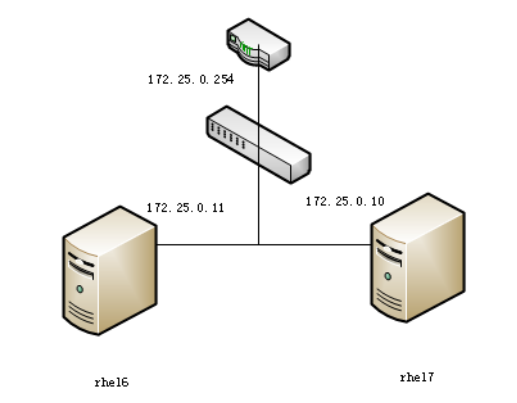
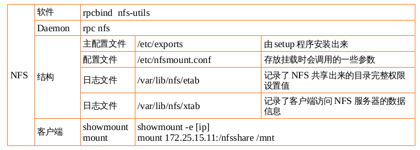
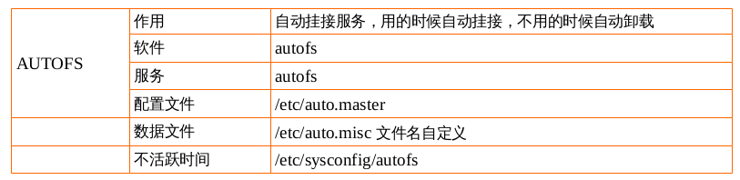

## NFS文件共享服务

- [NFS文件共享服务](#nfs文件共享服务)
	- [NFS是什么](#nfs是什么)
	- [NFS的原理](#nfs的原理)
	- [NFS的用处](#nfs的用处)
	- [项目实践1：配置NFS网络共享文件服务器](#项目实践1配置nfs网络共享文件服务器)
	- [配置文件详解](#配置文件详解)
	- [项目实践2：自动挂接NFS](#项目实践2自动挂接nfs)
		- [/etc/fstab](#etcfstab)
		- [/etc/bashrc](#etcbashrc)
		- [autofs 自动挂接服务](#autofs-自动挂接服务)
	- [总结](#总结)

---

### NFS是什么

NFS（Network File System）即网络文件系统，SUN公司开发的,是FreeBSD支持的文件系统中的一种，它允许网络中的计
算机之间通过TCP/IP网络共享资源。在NFS的应用中，本地NFS的客户端应用可以透明地读写位于远端NFS服务
器上的文件，就像访问本地文件一样。

### NFS的原理

假设我们有一个服务器，两个客户端。
客户端可以将网络中的NFS服务器共享的目录挂载到本地端的文件系统中，而在本地端的系统中看来，那个远程
主机的目录就好像自己的一个磁盘分区一样。

比如将配置好的NFS服务器上的`/var/share/student1`目录挂在到A客户端的`/home/share/student1`上
面，那在客户端A上面进入`/home/share/student1`内，就可以看到NFS服务器系统中`/var/share/student1`
目录下所有的内容了，并且可以执行`cd，cp，mv，rm`等命令。当然，权限要足够。
这个`/var/share/student1`就好像NFS客户端的一个文件系统一样。
所以，NFS也可以简单的看做是一个文件服务器（file system）

只要权限足够，客户端也可以对该目录下的内容进行读写操作等等。

**NFS指的是一种服务** 既然是服务，肯定会用到一些监听端口，那NFS用的是什么端口进行数据传输的？
我也不知道，谁都不知道。基本上NFS这个服务的端口开在2049端口，但由于文件系统非常复杂，NFS支持的功
能又相当的多，每一个功能就会启用一些端口来传输数据，所以，NFS需要调用额外的端口，那额外的端口号又
是什么呢？额外的端口号并不固定。因为NFS默认传输的端口是随机取用未被使用的小于1024的端口用于传输。
但如此一来，客户端连接服务器又成了问题，客户端并不知道我要链接那些端口。
这时候就需要用到远程过程调用RPC服务了 remote procedure call。
RPC就是指定NFS各功能对应的端口号，然后通知给客户端，让客户端可以连接到正确的端口上。


对于服务端来说，在NFS启动的时候，会自动向RPC注册其各个功能所需要的随机端口号，让RPC了解NFS各项
功能的端口号，PID，NFS所监听的IP等等。当客户端通过111端口号向server端RPC发出NFS访问请求时候，
RPC就会找到对应已注册的端口号，并返还给客户端，客户端就可以通过这些端口号与NFS发起链接。比如说我
是NFS，我在启动的时候，就会告诉RPC，我的A端口用于做什么事情，我的B端口用于做什么事情，RPC就会将
其端口注册信息登记，等客户端发起请求的时候就可以直接找到RPC，而不是直接找我NFS，RPC可以直接告知
客户端所需请求对应的正确的端口号。

当客户端执行操作文件系统的各项命令时候，会转交给客户端的RPC，客户端RPC负责接受各个程序与对应的端
口后负责对主机进行解析。所以要使用NFS时，无论是客户端还是服务端，都需要启动RPC。

启动NFS之前，RPC就要先启动了，不然NFS无法向RPC注册，并且，RPC重启以后，原来注册的数据就没有了，
所以RPC重新启动后，NFS也要重启，重新想RPC注册才行。

同样，A客户端对NFS服务器上的共享文件进行了修改后，B服务器能看到改后的文件，也就完成了各个主机之间文件的共享。
所以如果重启了rpc，nfs也必须要重新启动，以便于重新像rpc注册相应的端口号。

* NFS：处理客户端数据请求，
* RPC：处理客户端链接请求。

### NFS的用处

* 存储共享方案
* 网络共享文件系统

### 项目实践1：配置NFS网络共享文件服务器

要求rhel7 172.25.X.10 作为NFS网络共享文件服务器：

1. 允许172.25.X.11这个客户端来挂接使用/tmp目录，有读写权限。
2. 将读写权限改成只读权限；(ro)
3. 允许172.25.X.0/24网段挂接/tmp目录，有读写权限；
4. 服务器上创建uid=1200的用户tom，并使用tom用户创建/tmp/tomfile；在客户端创建uid=1200的用户jack，尝试去删除tomfile目录;
5. 为什么不建议使用(rw,no_root_squash)

##### 实验准备阶段

1. 网络拓扑图
2. 规划软件安装
3. 修改配置文件
4. 启动服务
6. 客户端测试服务		

> 网络拓扑图



> 规划软件安装

|主机名|ip地址|软件|功能|
|:--|:--|:--|:--|
|rhel6|172.25.0.11|rpcbind nfs-utils|服务端|
|rhel7|172.25.0.10|rpcbind nfs-utils|客户端|

```shell
[root@rhel6 ~]# yum install -y nfs-utils rpcbind
Loaded plugins: product-id, refresh-packagekit, security, subscription-manager
This system is not registered to Red Hat Subscription Management. You can use subscription-manager to register.
server                                                                                    | 3.9 kB     00:00     
server/primary_db                                                                         | 3.1 MB     00:00     
Setting up Install Process
Package 1:nfs-utils-1.2.3-39.el6.x86_64 already installed and latest version
Package rpcbind-0.2.0-11.el6.x86_64 already installed and latest version
Nothing to do
```
rpcbind

* rpc:管理客户端和服务端的ip和端口号---连接
* remote	procedure call——远程过程调用协议

nfs-utils

* nfs:传输数据

```shell
[root@rhel6 ~]# rpm -qf /etc/exports
setup-2.8.14-20.el6_4.1.noarch
[root@rhel6 ~]# rpm -ql rpcbind
/etc/rc.d/init.d/rpcbind
/sbin/rpcbind
/usr/sbin/rpcinfo
/usr/share/doc/rpcbind-0.2.0
/usr/share/doc/rpcbind-0.2.0/AUTHORS
/usr/share/doc/rpcbind-0.2.0/ChangeLog
/usr/share/doc/rpcbind-0.2.0/README
/usr/share/man/man8/rpcbind.8.gz
/usr/share/man/man8/rpcinfo.8.gz
/var/cache/rpcbind
[root@rhel6 ~]# rpm -ql nfs-utils
/etc/nfsmount.conf
/etc/rc.d/init.d/nfs
/etc/rc.d/init.d/nfslock
/etc/rc.d/init.d/rpcgssd
/etc/rc.d/init.d/rpcidmapd
/etc/rc.d/init.d/rpcsvcgssd
/etc/request-key.d/id_resolver.conf
/etc/sysconfig/nfs
/sbin/mount.nfs
/sbin/mount.nfs4
/sbin/nfs_cache_getent
/sbin/rpc.statd
/sbin/umount.nfs
/sbin/umount.nfs4
/usr/sbin/exportfs
/usr/sbin/mountstats
/usr/sbin/nfsidmap
/usr/sbin/nfsiostat
/usr/sbin/nfsstat
/usr/sbin/rpc.gssd
/usr/sbin/rpc.idmapd
/usr/sbin/rpc.mountd
/usr/sbin/rpc.nfsd
/usr/sbin/rpc.svcgssd
/usr/sbin/rpcdebug
/usr/sbin/showmount
/usr/sbin/sm-notify
/usr/sbin/start-statd
/usr/share/doc/nfs-utils-1.2.3
/usr/share/doc/nfs-utils-1.2.3/ChangeLog
/usr/share/doc/nfs-utils-1.2.3/INSTALL
/usr/share/doc/nfs-utils-1.2.3/KNOWNBUGS
/usr/share/doc/nfs-utils-1.2.3/Makefile
/usr/share/doc/nfs-utils-1.2.3/Makefile.am
/usr/share/doc/nfs-utils-1.2.3/Makefile.in
/usr/share/doc/nfs-utils-1.2.3/NEW
/usr/share/doc/nfs-utils-1.2.3/README
/usr/share/doc/nfs-utils-1.2.3/THANKS
/usr/share/doc/nfs-utils-1.2.3/TODO
/usr/share/man/man5/exports.5.gz
/usr/share/man/man5/nfs.5.gz
/usr/share/man/man5/nfsmount.conf.5.gz
/usr/share/man/man7/nfsd.7.gz
/usr/share/man/man8/exportfs.8.gz
/usr/share/man/man8/gssd.8.gz
/usr/share/man/man8/idmapd.8.gz
/usr/share/man/man8/mount.nfs.8.gz
/usr/share/man/man8/mount.nfs4.8.gz
/usr/share/man/man8/mountd.8.gz
/usr/share/man/man8/mountstats.8.gz
/usr/share/man/man8/nfsd.8.gz
/usr/share/man/man8/nfsidmap.8.gz
/usr/share/man/man8/nfsiostat.8.gz
/usr/share/man/man8/nfsstat.8.gz
/usr/share/man/man8/rpc.gssd.8.gz
/usr/share/man/man8/rpc.idmapd.8.gz
/usr/share/man/man8/rpc.mountd.8.gz
/usr/share/man/man8/rpc.nfsd.8.gz
/usr/share/man/man8/rpc.sm-notify.8.gz
/usr/share/man/man8/rpc.statd.8.gz
/usr/share/man/man8/rpc.svcgssd.8.gz
/usr/share/man/man8/rpcdebug.8.gz
/usr/share/man/man8/showmount.8.gz
/usr/share/man/man8/sm-notify.8.gz
/usr/share/man/man8/statd.8.gz
/usr/share/man/man8/svcgssd.8.gz
/usr/share/man/man8/umount.nfs.8.gz
/usr/share/man/man8/umount.nfs4.8.gz
/var/lib/nfs
/var/lib/nfs/etab
/var/lib/nfs/rmtab
/var/lib/nfs/rpc_pipefs
/var/lib/nfs/statd
/var/lib/nfs/statd/sm
/var/lib/nfs/statd/sm.bak
/var/lib/nfs/state
/var/lib/nfs/v4recovery
/var/lib/nfs/xtab
```

> 修改配置文件

**主配置文件** `/etc/exports`

**服务名** `rpcbind` `nfs`

根据要求，允许172.25.X.10这个客户端来挂接使用/tmp目录，有读写权限。配置`/etc/exports`内容
为`/tmp 172.25.0.10(rw)`后，根据服务名来打开相应的服务

```shell
[root@rhel6 ~]# vim /etc/exports
[root@rhel6 ~]# cat /etc/exports
/tmp 172.25.0.10(rw)
```

> 启动服务

```shell
[root@rhel6 ~]# service rpcbind start
[root@rhel6 ~]# service nfs start
Starting NFS services:                                     [  OK  ]
Starting NFS quotas:                                       [  OK  ]
Starting NFS mountd:                                       [  OK  ]
Starting NFS daemon:                                       [  OK  ]
Starting RPC idmapd:                                       [  OK  ]
[root@rhel6 ~]# netstat -luntp |grep rpcbind
tcp        0      0 0.0.0.0:111                 0.0.0.0:*                   LISTEN      1174/rpcbind        
tcp        0      0 :::111                      :::*                        LISTEN      1174/rpcbind        
udp        0      0 0.0.0.0:111                 0.0.0.0:*                               1174/rpcbind        
udp        0      0 0.0.0.0:925                 0.0.0.0:*                               1174/rpcbind        
udp        0      0 :::111                      :::*                                    1174/rpcbind        
udp        0      0 :::925                      :::*                                    1174/rpcbind        
[root@rhel6 ~]# netstat -luntp |grep nfs
[root@rhel6 ~]# ps -ef|grep nfs
root      1888     2  0 15:20 ?        00:00:00 [nfsd4]
root      1889     2  0 15:20 ?        00:00:00 [nfsd4_callbacks]
root      1890     2  0 15:20 ?        00:00:00 [nfsd]
root      1891     2  0 15:20 ?        00:00:00 [nfsd]
root      1892     2  0 15:20 ?        00:00:00 [nfsd]
root      1893     2  0 15:20 ?        00:00:00 [nfsd]
root      1894     2  0 15:20 ?        00:00:00 [nfsd]
root      1895     2  0 15:20 ?        00:00:00 [nfsd]
root      1896     2  0 15:20 ?        00:00:00 [nfsd]
root      1897     2  0 15:20 ?        00:00:00 [nfsd]
root      1928  1745  0 15:20 pts/0    00:00:00 grep nfs
[root@rhel6 ~]# service iptables stop
iptables: Setting chains to policy ACCEPT: filter          [  OK  ]
iptables: Flushing firewall rules:                         [  OK  ]
iptables: Unloading modules:                               [  OK  ]
```

**守护进程daemon** `rpcbind` `nfsd`

**监听端口号** 111 925

> 客户端测试使用

查看服务器共享目录的情况 `showmount -e 172.25.0.11`

远程挂载 `mount 172.25.0.10:/tmp /mnt `

```shell
[root@rhel7 ~]# yum install -y nfs-utils rpcbind
Loaded plugins: langpacks, product-id, subscription-manager
This system is not registered to Red Hat Subscription Management. You can use subscription-manager to register.
Package 1:nfs-utils-1.3.0-0.el7.x86_64 already installed and latest version
Package rpcbind-0.2.0-23.el7.x86_64 already installed and latest version
Nothing to do
[root@rhel7 ~]# showmount -e 172.25.0.11
Export list for 172.25.0.11:
/tmp 172.25.0.10
[root@rhel7 ~]# mount 172.25.0.11:/tmp /mnt
[root@rhel7 ~]# mount |tail -n 1
172.25.0.11:/tmp on /mnt type nfs4 (rw,relatime,vers=4.0,rsize=131072,wsize=131072,namlen=255,hard,proto=tcp,port=0,timeo=600,retrans=2,sec=sys,clientaddr=172.25.0.10,local_lock=none,addr=172.25.0.11)
[root@rhel7 mnt]# touch rhel7test
[root@rhel7 mnt]# ll
total 12
drwx------. 2 gdm       gdm       4096 Sep 25 02:59 orbit-gdm
drwx------. 2 root      root      4096 Jul  2  2015 pulse-oCBy0hGD1JT6
drwx------. 2 gdm       gdm       4096 Sep 25 02:59 pulse-q5sECpImz7Ju
-rw-r--r--. 1 nfsnobody nfsnobody    0 Sep 25  2016 rhel7test
[root@rhel7 mnt]# cd
[root@rhel7 ~]# umount /mnt
```
**nfsnobody** 以 root 用户创建的文件被映射成 nfsnobody 用户 , 因为在服务器上没有指定 no_root_squash

> 将读写权限改成只读权限；(ro)

服务器端修改配置文件

```shell
[root@rhel6 ~]# vim /etc/exports
[root@rhel6 ~]# cat /etc/exports
/tmp 172.25.0.10(ro)
[root@rhel6 ~]# service rpcbind restart
Stopping rpcbind:                                          [  OK  ]
Starting rpcbind:                                          [  OK  ]
[root@rhel6 ~]# service nfs restart
Shutting down NFS daemon:                                  [  OK  ]
Shutting down NFS mountd:                                  [  OK  ]
Shutting down NFS quotas:                                  [  OK  ]
Shutting down NFS services:                                [  OK  ]
Shutting down RPC idmapd:                                  [  OK  ]
Starting NFS services:                                     [  OK  ]
Starting NFS quotas:                                       [  OK  ]
Starting NFS mountd:                                       [  OK  ]
Starting NFS daemon:                                       [  OK  ]
Starting RPC idmapd:                                       [  OK  ]
```

客户端rhel7

```shell
[root@rhel7 ~]# mount 172.25.0.11:/tmp /mnt
[root@rhel7 ~]# touch /mnt/rhel7test2
touch: cannot touch ‘/mnt/rhel7test2’: Read-only file system
[root@rhel7 ~]# umount /mnt
```

> 允许172.25.X.0/24网段挂接/tmp目录，有读写权限；

修改配置文件为 `/tmp 172.25.0.0/24(rw)`

```shell
[root@rhel6 ~]# vim /etc/exports
[root@rhel6 ~]# cat /etc/exports
/tmp 172.25.0.0/24(rw)
[root@rhel6 ~]# service rpcbind restart
Stopping rpcbind:                                          [  OK  ]
Starting rpcbind:                                          [  OK  ]
[root@rhel6 ~]# service nfs restart
Shutting down NFS daemon:                                  [  OK  ]
Shutting down NFS mountd:                                  [  OK  ]
Shutting down NFS quotas:                                  [  OK  ]
Shutting down NFS services:                                [  OK  ]
Shutting down RPC idmapd:                                  [  OK  ]
Starting NFS services:                                     [  OK  ]
Starting NFS quotas:                                       [  OK  ]
Starting NFS mountd:                                       [  OK  ]
Starting NFS daemon:                                       [  OK  ]
Starting RPC idmapd:                                       [  OK  ]
```

> 分别在客户端和服务器上都创建一个id=1200的用户tom，在客户端用tom用户新建一个文件rhel7tomfile，并查看属性，再到服务器上去查看该文件的属性；
在服务器上用tom用户去创建rhel6tomfile，查看属性，再到客户端上查看属性。

```shell
# 服务端rhel6
[root@rhel6 ~]# useradd -u 1200 tom
[root@rhel6 ~]# echo uplooking|passwd --stdin tom
Changing password for user tom.
passwd: all authentication tokens updated successfully.
[root@rhel6 ~]# su - tom
[tom@rhel6 ~]$ touch /tmp/tomfile
[tom@rhel6 ~]$ ll /tmp/tomfile
-rw-rw-r--. 1 tom tom 0 Sep 25 15:55 /tmp/tomfile
[tom@rhel6 tmp]$ touch rhel6tomfile

# 客户端rhel7
[tom@rhel7 mnt]$ touch rhel7tomfile
[tom@rhel7 mnt]$ ll
total 12
-rw-rw-r--. 1 nobody nobody    0 Sep 25 04:03 4913
drwx------. 2 gdm    gdm    4096 Sep 25 02:59 orbit-gdm
drwx------. 2 root   root   4096 Jul  2  2015 pulse-oCBy0hGD1JT6
drwx------. 2 gdm    gdm    4096 Sep 25 02:59 pulse-q5sECpImz7Ju
-rw-rw-r--. 1 nobody nobody    0 Sep 25 04:07 rhel7tomfile
-rw-rw-r--. 1 nobody nobody    0 Sep 25 04:06 tomfile
[tom@rhel7 mnt]$ rm -rf rhel7tomfile
rm: cannot remove ‘rhel7tomfile’: Operation not permitted
[tom@rhel7 mnt]$ rm -rf rhel6tomfile
rm: cannot remove ‘rhel6tomfile’: Operation not permitted

# 服务端rhel6
[tom@rhel6 tmp]$ ll
total 12
-rw-rw-r--. 1 tom  tom     0 Sep 25 16:03 4913
drwx------. 2 gdm  gdm  4096 Sep 25 14:59 orbit-gdm
drwx------. 2 root root 4096 Jul  2  2015 pulse-oCBy0hGD1JT6
drwx------. 2 gdm  gdm  4096 Sep 25 14:59 pulse-q5sECpImz7Ju
-rw-rw-r--. 1 tom  tom     0 Sep 25 16:10 rhel6tomfile
-rw-rw-r--. 1 tom  tom     0 Sep 25 16:07 rhel7tomfile
```

两个新文件在客户端均显示属于nobody，而在服务器端显示属于tom用户，
并且会发现在客户端由tom用户创建出来的文件也没有办法删除。

这是由于当前服务器版本比客户端低的缘故。

如果将rhel7作为服务端，rhel6作为客户端，就不会出现上述问题了。如下所示：

|主机名|ip地址|软件|功能|
|:--|:--|:--|:--|
|rhel6|172.25.0.11|rpcbind nfs-utils|客户端|
|rhel7|172.25.0.10|rpcbind nfs-utils|服务端|

```shell
# 服务端rhel7
[root@rhel7 ~]# vim /etc/exports
[root@rhel7 ~]# systemctl stop firewalld
[root@rhel7 ~]# systemctl start rpcbind
[root@rhel7 ~]# systemctl start nfs
# 客户端rhel6
[root@rhel6 tmp]# mount 172.25.0.10:/tmp /mnt
[root@rhel6 tmp]# cd /mnt
[tom@rhel6 mnt]$ touch rhel6tomfile
[tom@rhel6 mnt]$ ll
total 0
-rw-rw-r--. 1 tom  tom   0 Sep 25 16:22 rhel6tomfile
drwx------. 3 root root 16 Sep 25 14:59 systemd-private-hPL7GQ
drwx------. 3 root root 16 Sep 25 14:58 systemd-private-jFcaMN
# 服务端rhel7
[tom@rhel7 tmp]$ touch rhel7tomfile
[tom@rhel7 tmp]$ ll
total 0
-rw-rw-r--. 1 tom  tom   0 Sep 25 04:22 rhel6tomfile
-rw-rw-r--. 1 tom  tom   0 Sep 25 04:24 rhel7tomfile
drwx------. 3 root root 16 Sep 25 02:59 systemd-private-hPL7GQ
drwx------. 3 root root 16 Sep 25 02:58 systemd-private-jFcaMN
# 客户端rhel6
[tom@rhel6 mnt]$ ll
total 0
-rw-rw-r--. 1 tom  tom   0 Sep 25 16:22 rhel6tomfile
-rw-rw-r--. 1 tom  tom   0 Sep 25 16:24 rhel7tomfile
drwx------. 3 root root 16 Sep 25 14:59 systemd-private-hPL7GQ
drwx------. 3 root root 16 Sep 25 14:58 systemd-private-jFcaMN
[tom@rhel6 mnt]$ rm -rf rhel6tomfile
[tom@rhel6 mnt]$ rm -rf rhel7tomfile
[tom@rhel6 mnt]$ ll
total 0
drwx------. 3 root root 16 Sep 25 14:59 systemd-private-hPL7GQ
drwx------. 3 root root 16 Sep 25 14:58 systemd-private-jFcaMN
```

**文件所属者和所属组是根据uid和gid来匹配的。**

```shell
# 服务器rhel7
[root@rhel7 ~]# useradd -u 1003 batman
[root@rhel7 ~]# echo uplooking|passwd --stdin batman
Changing password for user batman.
passwd: all authentication tokens updated successfully.
[root@rhel7 ~]# id batman
uid=1003(batman) gid=1003(batman) groups=1003(batman)
[root@rhel7 ~]# su batman
[batman@rhel7 root]$ cd /tmp
[batman@rhel7 tmp]$ ll
total 0
drwx------. 3 root root 16 Sep 25 02:59 systemd-private-hPL7GQ
drwx------. 3 root root 16 Sep 25 02:58 systemd-private-jFcaMN
[batman@rhel7 tmp]$ touch rhel7batmanfile
[batman@rhel7 tmp]$ ll
total 0
-rw-rw-r--. 1 batman batman  0 Sep 25 04:27 rhel7batmanfile
drwx------. 3 root   root   16 Sep 25 02:59 systemd-private-hPL7GQ
drwx------. 3 root   root   16 Sep 25 02:58 systemd-private-jFcaMN


[root@rhel6 mnt]# ll
total 0
-rw-rw-r--. 1 1003 1003  0 Sep 25 16:27 rhel7batmanfile
drwx------. 3 root root 16 Sep 25 14:59 systemd-private-hPL7GQ
drwx------. 3 root root 16 Sep 25 14:58 systemd-private-jFcaMN
[root@rhel6 mnt]# useradd -u 1003 superman
[root@rhel6 mnt]# echo uplooking|passwd --stdin superman
Changing password for user superman.
passwd: all authentication tokens updated successfully.
[root@rhel6 mnt]# ll
total 0
-rw-rw-r--. 1 superman superman  0 Sep 25 16:27 rhel7batmanfile
drwx------. 3 root     root     16 Sep 25 14:59 systemd-private-hPL7GQ
drwx------. 3 root     root     16 Sep 25 14:58 systemd-private-jFcaMN
[root@rhel6 mnt]# su  superman
[superman@rhel6 mnt]$ ll
total 0
-rw-rw-r--. 1 superman superman  0 Sep 25 16:27 rhel7batmanfile
drwx------. 3 root     root     16 Sep 25 14:59 systemd-private-hPL7GQ
drwx------. 3 root     root     16 Sep 25 14:58 systemd-private-jFcaMN
[superman@rhel6 mnt]$ rm -rf rhel7batmanfile
[superman@rhel6 mnt]$ ll
total 0
drwx------. 3 root root 16 Sep 25 14:59 systemd-private-hPL7GQ
drwx------. 3 root root 16 Sep 25 14:58 systemd-private-jFcaMN
```

在服务器上以 batman 用户创建的文件被映射成客户端的 superman 用户 , 因为在服务器上 batman 的 id 与 superman 的 id 相同

> 为什么不建议使用(rw,no_root_squash)

**面试题**

1. 客户说为什么我是root，却不能删除root的文件呢（前提是该文件是nfs服务挂接使用的）？
* 1）考虑到安全，当前我们nfs的配置中就设置为本地的root用户是没有权限删除服务器端的root用户文件的。
* 2）如果客户你一定要去有这个权限，那么你可以修改配置，添加一个no_root_squash；不建议这么做。

2. 客户电话咨询说服务器出故障了，
* 1）挂接目录执行任何操作就卡死了，然后我重启，就卡在哪里了，/mnt
* 2）前一天还正常，今天上班开不了机了
* 3）mount查看当前挂接目录，卡在哪里，杀掉进程，再mount还是卡在那里

以上都有可能是nfs服务器连接出现问题了，应该去检查一下nfs服务器的运行情况。再排错。


### 配置文件详解

#### 主配置文件/etc/exports

关于exports的写法，我们可以通过  `man 5 exports` 来查看 `EXAMPLES`

```shell
# sample /etc/exports file
#      共享目录             客户端列表（权限）
       /               master(rw) trusty(rw,no_root_squash)
       /projects       proj*.local.domain(rw)
       /usr            *.local.domain(ro) @trusted(rw)
       /home/joe       pc001(rw,all_squash,anonuid=150,anongid=100)
       /pub            *(ro,insecure,all_squash)
       /srv/www        -sync,rw server @trusted @external(ro)
       /foo            2001:db8:9:e54::/64(rw) 192.0.2.0/24(rw)
       /build          buildhost[0-9].local.domain(rw)
```

详细参数解释如下表所示：

|参数|说明|
|:--|:--|
|rw|可读可写|
|ro|只读|
|sync|数据同步写入内存缓冲区与磁盘中，虽然这样做效率较低，但可以保证数据的一致性（适合于小文件传输）|
|async|数据先暂时放于内存，而非直接写入硬盘，等到必要时才写入磁盘（适合于大文件传输）|
|no_root_squash|使用nfs时，如果用户是root，不进行权限压缩，即root用户在nfs上创建的文件   属组和属主仍然是root（不安全，不建议使用）|
|root_squash|使用nfs时，如果用户是root，则进行权限压缩，即把root用户在nfs上创建的文件   属组和属主修改为nfsnobody|
|all_squash|所有的普通用户使用nfs都将使用权限压缩，即：将远程访问的所有普通用户及所属用户组都映射为匿名用户或者用户组（一般均为nfsnobody）|
|no_all_squash|所有的普通用户使用nfs都不使用权限压缩，即：不将远程访问的所有普通用户及所属用户组都映射为匿名用户或者用户组（默认设置）|
|anonuid=XXX|anon即anonymous(匿名者)，前面关于*\_squash提到的匿名用户的uid的设置值，通常为nobody或者nfsnobody，使用这个参数可以自行设定这个uid值，这个uid必须存在 于/etc/passwd|
|anongid=XXX|将远程访问的所有用户组都映身为匿名用户组账户，并指定该匿名用户组账户为本地用户组账户（GID=XXX）|
|insecure|允许客户端从大于1024的TCP/IP端口连NFS服务器|
|secure|限制客户端只能从小于1024的TCP/IP端口连接NFS服务器(默认设置)|
|wdelay|检查是否有相关的写操作，如果有则将这些写操作一起执行，这样可提高效率(默认设置)|
|no_wdelay|若有写操作则立即执行（应与sync配置）|
|subtree_check|若输出目录是一个子目录，则NFSW:务器将检查其父目录的权限(默认设置)|
|no_subtree_check|即使输出目录是一个子目录，NFS服务器也不检查其父目录的权限，这样做可提高效率|

**设置实例**

`/tmp *(rw,no_root_squash)`


在所有的IP（主机）上登录的用户都可对NFS服务器上的共享目录/tmp拥有rw操作权限，同时如果是root用户访问该共享目录，那么不将root用户及所属用户组都映射为匿名用户或用户组（\*表示所有的主机或者IP）

`/tmp *(rw)`


在所有的IP（主机）登录的用户都可对NFS服务器上的共享目录/tmp拥有rw操作权限

`/home/public 192.168.0.*(rw)   *(ro)`  或者 `/home/public 192.168.0.0/24(rw) *(ro)`


除了在`192. 168. 0.0/24`这个网段内的主机上登录的用户，可对NFS服务器共享目录`/home/public`进行`rw`操作权限，而其它网段的主机上登录的用户，对NFS服务器共享目录`/home/public`只能进行`r`操作

`/home/test 192.168.0.100(rw)`

只对`192.168.0.100`该台主机设置权限，即：使在该台主机登录的用户都可对NFS服务器上的共享目录`/home/test`拥有读与写的操作

`/home/linux *.linux.org(rw,all_squash,anonuid=40,anongid=40)`


当`*.linux.org`（加入域`linux.org`的所有主机） 登陆此NFS主机，并且在`/home/linux`下面写入档案时，该档案的所有人与所有组，就会变成NFS服务器上的`/etc/passwd`文件里面对应的`UID`为40的那个身份的使用者了（因为指定了参数：`all_squash，anonuid=40，anongid=40`）

---

### 项目实践2：自动挂接NFS

要求分别通过下面三种方法实现自动挂接 	
	*	/etc/fstab（容易出问题）
	* /etc/bashrc
	* autofs服务

#### /etc/fstab

```shell
[root@rhel6 ~]# vim /etc/fstab
172.25.0.10:/tmp        /mnt                    nfs     defaults        0 0
[root@rhel6 ~]# mount -a
[root@rhel6 ~]# mount |tail -n 1
172.25.0.10:/tmp on /mnt type nfs (rw,vers=4,addr=172.25.0.10,clientaddr=172.25.0.11)
```

如果nfs服务器出现问题，导致客户端无法挂接，此时就会出现开机启动失败的情况。因此不建议这么做。

#### /etc/bashrc

```shell
[root@rhel6 ~]# vim /etc/bashrc
[root@rhel6 ~]# grep mount /etc/bashrc
mount 172.25.0.10:/tmp /mnt
[root@rhel6 ~]# reboot

Broadcast message from root@rhel6
	(/dev/pts/0) at 16:53 ...

The system is going down for reboot NOW!
[root@rhel6 ~]# Connection to 172.25.0.11 closed by remote host.
Connection to 172.25.0.11 closed.
[root@foundation0 ~]# ssh root@172.25.0.11
Last login: Sun Sep 25 16:52:03 2016 from 172.25.0.250


mount.nfs: Connection timed out
```

如果将挂接的命令放在开机启动后的终端启动脚本中，那么只会有一个报错而已。


#### autofs 自动挂接服务

使用的时候挂接，不使用等待5分钟后卸载，而等待的时间时可以调整的，在`/etc/sysconfig/autofs`配置
文件中通过`TIMEOUT`参数调整，例如`TIMEOUT=300`。

1. 软件		autofs
2. service		autofs
3. daemon		automount		
4. 配置文件
	* /etc/auto.master	父挂接点
	* /etc/auto.booboo	子挂接点
~~~
172.25.0.10:/tmp /mnt/share
		/mnt	父挂接点
		share	子挂接点
~~~

5. 配置文件格式

可以通过`man 5 autofs`查看配置文件的格式

~~~
/etc/auto.master
/mnt	/etc/auto.booboo

/etc/auto.booboo
share	-rw	172.25.0.10:/tmp
~~~

**自动挂接autofs场景**

rhel7 作为nfs网络共享文件系统服务；rhel6作为nfs的客户端现在想自动挂接rhel7的/tmp目录使用，可以通过autofs。

|主机名|ip地址|软件|功能|
|:--|:--|:--|:--|
|rhel6|172.25.0.11|rpcbind nfs-utils|nfs客户端；autofs服务端|
|rhel7|172.25.0.10|rpcbind nfs-utils|nfs服务端|

```shell
[root@rhel6 ~]# yum install -y autofs
Loaded plugins: product-id, refresh-packagekit, security, subscription-manager
This system is not registered to Red Hat Subscription Management. You can use subscription-manager to register.
Setting up Install Process
Package 1:autofs-5.0.5-88.el6.x86_64 already installed and latest version
Nothing to do
[root@rhel6 ~]# rpm -ql autofs
/etc/auto.master
/etc/auto.misc
/etc/auto.net
/etc/auto.smb
/etc/autofs_ldap_auth.conf
/etc/rc.d/init.d/autofs
/etc/sysconfig/autofs
/misc
/net

[root@rhel6 ~]# vim /etc/auto.master
/mnt    /etc/auto.booboo
[root@rhel6 ~]# vim /etc/auto.booboo
share   -rw     172.25.0.10:/tmp

[root@rhel6 ~]# mkdir /mnt/share
[root@rhel6 ~]# service autofs start
Starting automount:                                        [  OK  ]
[root@rhel6 ~]# ll /mnt/share
total 0
drwx------. 3 root root 16 Sep 25 14:59 systemd-private-hPL7GQ
drwx------. 3 root root 16 Sep 25 14:58 systemd-private-jFcaMN
```


### 总结




