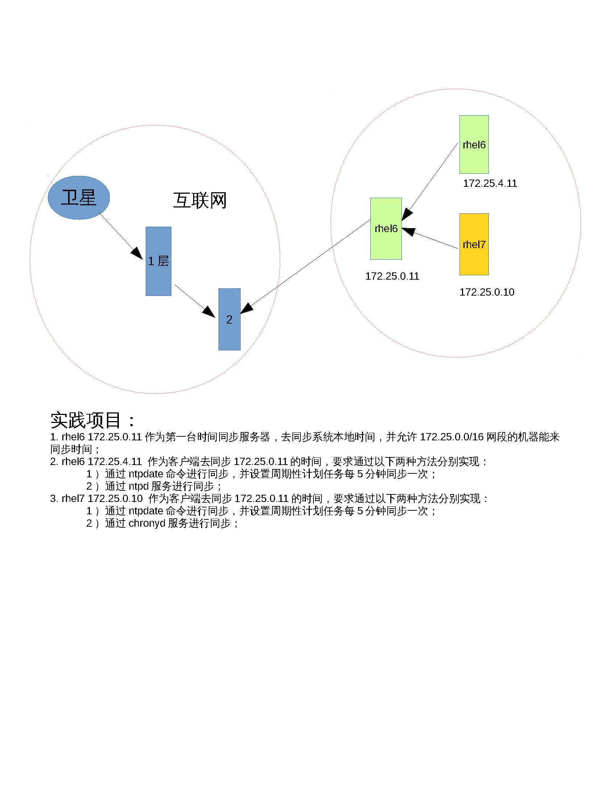
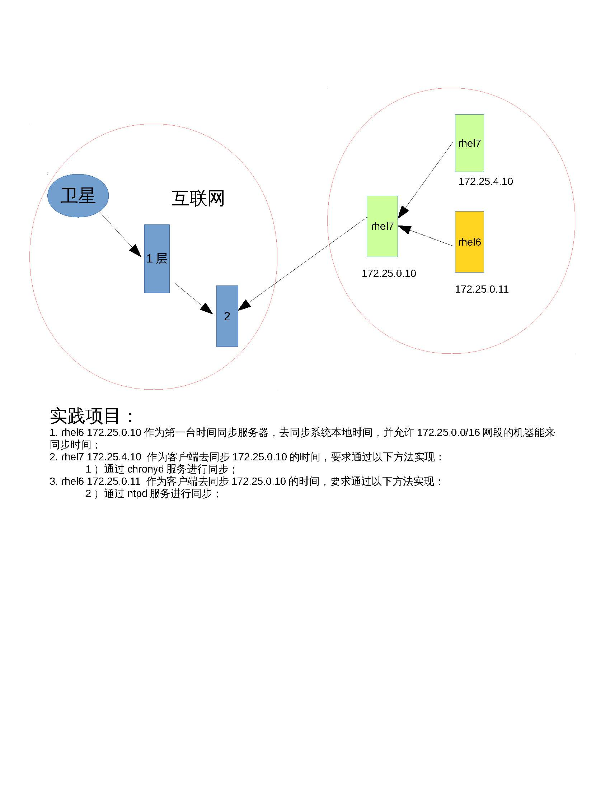

## 时间同步服务NTP/Chony

[TOC]

---
|服务| 域名解析服务| 		文件共享服务|	|	|	web服务|
|:--|:--|:--|:--|:--|:--|
|	|DNS	|	FTP|	NFS|		SAMBA|		APACHE|
|软件	|bind	bind-chroot	|vsftpd 	|rpcbind nfs-utils		|samba	samba-common	|httpd|
|服务|	named	|	vsftpd|	rpcbind nfs|smb nmb	|httpd	|
|daemon	|named	|	vsftpd|rpcbind nfs|smbd nmbd|httpd|
|端口号|	53	|	21	|111 2049|	137 138 139 445 |80 8080|
|配置文件	|/etc/named.conf /etc/named.rfc1912.zones|/etc/vsftpd/vsftpd.conf|/etc/exports|/etc/samba/smb.conf|/etc/httpd/conf/httpd.conf|
|数据文件	|/var/named/|/var/ftp/||/var/lib/samba|/var/www|
|客户端|		|	lftp|	rpcbind	|	samba-client|	elinks|
|命令	|nslookup|	lftp|	nfs-utils mount|		smbclient	|links|

---

### Ntp服务的作用

大家设想一下，如果我们的主机时间不准，可以怎么做？有将硬件时间和软件时间同步的办法，也可以使用`date -s`去设置一个时间，但是你怎么知道你设置的时间就一定准了，或者说你能确定硬件时间一定准么？不能保证吧？那这时候我们就可以找天文台或者一些网络上的时间服务器去做同步，那这时候怎么去做呢？

这里就用到一种服务了，这种服务叫做ntp服务，它是一种针对时间同步的服务。

### Ntp服务的原理

其实更细化来说，NTP服务器（Network Time Protocol）是用来使计算机时间同步化的一种协议，它可以使计算机对其服务器或时钟源（如石英钟，GPS等等)做同步化，它可以提供高精准度的时间校正（LAN上与标准间差小于1毫秒，WAN上几十毫秒），且可介由加密确认的方式来防止恶毒的协议攻击。时间按NTP服务器的等级传播。按照离外部UTC源的远近把所有服务器归入不同的Stratum（层）中。

Stratum层也是一个分层式的结构，下一层找上一层做同步，上一层还有上一层。以此类推。

### 时间同步服务配置


服务端

||rhel6|rhel7|
|:--|:--|:--|
|软件|ntp|chrony|
|service|ntpd|chronyd|
|daemon|ntpd|chronyd|
|配置文件|/etc/ntp.conf|/etc/chrony.conf|
|数据文件|/var/lib/ntp|/var/lib/chrony|
|日志文件|/var/log/ntpstats|/var/log/chrony|

客户端

|命令|ntpdate|timedatectl|
|:--|:--|:--|
||ntpdate 172.25.0.11|timedatectl set-ntp 1|


### 项目实践1：配置ntp时间同步服务器


rhel6 软件

ntp-4.2.6p5-1.el6.x86_64

#### 配置详解

NTP安全设置(restrict)

运行一个NTP Server不需要占用很多的系统资源,所以也不用专门配置独立的服务器,就可以给许多client提供时间同步服务, 但是一些基本的安全设置还是很有必要的那么这里一个很简单的思路就是第一我们只允许局域网内一部分的用户连接到我们的服务器. 第二个就是这些client不能修改我们服务器上的时间

driftfile /var/lib/ntp/drift  #侦测BIOS时钟与Linux系统时间的差异写入次文件。

利用restrict 来管理权限控制

Restrict [IP]  mask [netmask_IP] [parameter]

Parameter 的参数主要如下：
*	ignore :拒绝所有类型的NTP联机。
*	nomodify: 客户端不能使用ntpc 与ntpq 这两个程序来修改服务器的时间参数，但客户端可透过这部主机来进行网络校时；
*	noquery:客户端不能够使用ntpc 与ntpq 等指令来查询时间服务器，不提供NTP的网络校时。
*	notrap:不提供trap 这个运程事件登入的功能。
*	notrust:拒绝没有认证的客户端。
*	Kod:kod技术可以阻止“Kiss of Death “包对服务器的破坏。拒绝服务攻击
*	Nopeer:不与其他同一层的NTP服务器进行时间同步。


利用server 设定上层NTP服务器，格式如下：

server [IP or hostname] [prefer]
*	perfer:表示优先级最高
*	burst ：当一个运程NTP服务器可用时，向它发送一系列的并发包进行检测。
*	iburst ：当一个运程NTP服务器不可用时，向它发送一系列的并发包进行检测。

	注：默认情况小15分钟后才会与上层NTP服务器进行时间校对。


>谁能来同步我的时间？

首先我们对于默认的client拒绝所有的操作

代码:
`restrict default kod nomodify notrap nopeer noquery`

然后允许本机地址一切的操作

代码:
`restrict 127.0.0.1`

最后我们允许局域网内所有client连接到这台服务器同步时间.但是拒绝让他们修改服务器上的时间

代码:
`restrict 172.25.0.0 mask 255.255.255.0 nomodify`


>我去同步谁的时间？

server 	时间同步服务器	层数比我高的，及数字比我小的

代码:
```shell
server  127.127.1.0     # local clock
fudge   127.127.1.0 stratum 10
```

####　详细步骤

```shell
# 服务器端

[root@rhel6 ~]# yum install -y ntp
[root@rhel6 ~]# vim /etc/ntp.conf
[root@rhel6 ~]# grep -v "^#" /etc/ntp.conf|grep -v "^$"
driftfile /var/lib/ntp/drift
restrict default kod nomodify notrap nopeer noquery
restrict -6 default kod nomodify notrap nopeer noquery
restrict 127.0.0.1
restrict -6 ::1
restrict 172.25.0.0 mask 255.255.255.0 nomodify
server 172.25.0.11
server  127.127.1.0     
fudge   127.127.1.0 stratum 10
includefile /etc/ntp/crypto/pw
keys /etc/ntp/keys
[root@rhel6 ~]# service ntpd start
Starting ntpd:                                             [  OK  ]
[root@rhel6 ~]# service iptables stop

# 客户端
[root@rhel7 ~]# which ntpdate
/usr/sbin/ntpdate
[root@rhel7 ~]# rpm -qf /usr/sbin/ntpdate
ntpdate-4.2.6p5-18.el7.x86_64
[root@rhel7 ~]# systemctl stop firewalld
[root@rhel7 ~]# ntpdate 172.25.0.11
 2 Aug 06:36:51 ntpdate[8128]: step time server 172.25.0.11 offset -0.691491 sec
[root@rhel7 ~]# date -s "2016-08-01"
Mon Aug  1 00:00:00 EDT 2016
[root@rhel7 ~]# date
Mon Aug  1 00:00:01 EDT 2016
[root@rhel7 ~]# ntpdate 172.25.0.11
 2 Aug 06:37:35 ntpdate[8140]: step time server 172.25.0.11 offset 110240.425235 sec
[root@rhel7 ~]# date
Tue Aug  2 06:37:37 EDT 2016
```

#### 一些补充和拾遗（挺重要）

1. 配置文件中的driftfile是什么?
我们每一个system clock的频率都有小小的误差,这个就是为什么机器运行一段时间后会不精确.NTP会自动来监测我们时钟的误差值并予以调整.但问题是这是一个冗长的过程,所以它会把记录下来的误差先写入driftfile.这样即使你重新开机以后之前的计算结果也就不会丢失了

2. 如何同步硬件时钟?
NTP一般只会同步system clock. 但是如果我们也要同步RTC(hwclock)的话那么只需要把下面的选项打开就可以了

代码:
```shell
# vi /etc/sysconfig/ntpd
SYNC_HWCLOCK=yes
```

3. 让rhel6运行ntpdate更新时间时，rhel6同步失败，会提示端口被占用：如下
```shell
[root@rhel6 ~]# ntpdate 172.25.0.11
 2 Aug 18:39:16 ntpdate[4831]: the NTP socket is in use, exiting
```
4. 利用crontab让rhel7 NTP定时更新时间
```shell
0 8 * * * /usr/sbin/ntpdate 172.25.0.11
```
---

### chrony

chrony-1.29.1-1.el7.x86_64

RHEL从7.0开始改用chrony同步时间，原ntp同步方式也可以使用，但要安装ntp服务。

chronyd是一个在系统后台运行的守护进程。他根据网络上其他时间服务器时间来测量本机时间的偏移量从而调整系统时钟。对于孤立系统，用户可以手动周期性的输入正确时间（通过chronyc）。在这两种情况下，chronyd决定计算机快慢的比例，并加以纠正。chronyd实现了NTP协议并且可以作为服务器或客户端。

#### 项目实践2：配置chrony时间同步服务器

```shell
[root@rhel7 ~]# yum install -y chrony

[root@rhel7 ~]# vim /etc/chrony.conf
[root@rhel7 ~]# grep -v "^#" /etc/chrony.conf |grep -v "^$"
server 172.25.0.10
allow 172.25.0.0/24
stratumweight 0
driftfile /var/lib/chrony/drift
rtcsync
makestep 10 3
bindcmdaddress 127.0.0.1
bindcmdaddress ::1
keyfile /etc/chrony.keys
commandkey 1
generatecommandkey
noclientlog
logchange 0.5
logdir /var/log/chrony
[root@rhel7 ~]# timedatectl
      Local time: Tue 2016-08-02 07:24:15 EDT
  Universal time: Tue 2016-08-02 11:24:15 UTC
        RTC time: Tue 2016-08-02 11:24:15
        Timezone: America/New_York (EDT, -0400)
     NTP enabled: yes
NTP synchronized: yes
 RTC in local TZ: no
      DST active: yes
 Last DST change: DST began at
                  Sun 2016-03-13 01:59:59 EST
                  Sun 2016-03-13 03:00:00 EDT
 Next DST change: DST ends (the clock jumps one hour backwards) at
                  Sun 2016-11-06 01:59:59 EDT
                  Sun 2016-11-06 01:00:00 EST
```

### 项目汇总



