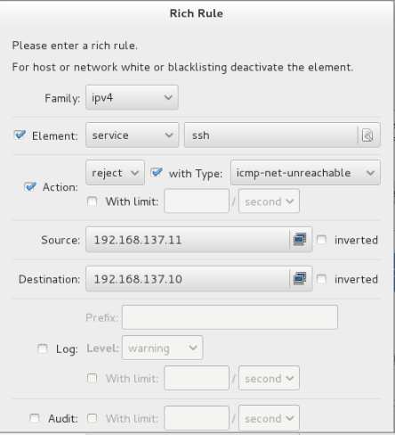

## 防火墙 iptables

[TOC]

---
### 防火墙的作用

防火墙是一个组件，工作在网络边缘（主机边缘），对进出网络数据包基于一定的规则检查，并在匹配某规则时由规则定义的处理进行处理的一组功能的组件。

### 防火墙类型

根据工作的层次的不同来划分，常见的防火墙工作在OSI第三层，即网络层防火墙，工作在OSI第七层的称为应用层防火墙，或者代理服务器（代理网关）。

网络层防火墙又称包过滤防火墙，在网络层对数据包进行选择，选择的依据是系统内设置的过滤逻辑，通过检查数据流中每个数据的源地址，目的地址，所用端口号和协议状态等因素来确定是否允许该数据包的通过，以及数据包的流向等。

还可以分为硬件防火墙和软件防火墙

### 软件防火墙

* EL6上的防火墙叫做iptables。
* EL7上的防火墙叫做firewalld。


### iptables语法

iptables -t table CMD chain rule-matcher -j target

	表	  动作 链	规则匹配	   执行操作

#### 表table

使用 -t 来指定表,如果省略,则代表对 filter 表进行操作

*	filter 表:用于过滤数据包
*	nat 表:用于修改数据包的来源和目的地
*	mangle 表:用户修改数据包的生存周期等等
*	raw 表:跟踪机制


#### CMD动作

*	A 追加
*	I 插入
*	D 删除
*	L 罗列
*	F 清空

#### 表当中包含链chain

链是用来区分数据包的流向状态

*	INPUT 入站的数据包
*	OUTPUT 出站的数据包
*	PREROUTING 路由判断之前的数据包
*	POSTROUTING 路由判断之后的数据包
*	FORWARD 第一次路由判断之后,到最后一词路由判断之前

#### 规则rule

是用来判断数据包的具体情况

*	-p 协议
*	-s 来源
*	-d 目的地
*	--sport 来源端口
*	--dport 目的端口
*	-i 入站网络接口
*	-o 出站网络接口
*	! 取反

#### 执行操作target

*	ACCEPT 接受
*	DROP 丢弃
*	REJECT 拒绝
*	DNAT 目标地址转换
*	SNAT 源地址转换

### 应用实例

0. 查看规则	`iptables -L`
1. 规则清空	`iptables -F`
2. 预选策略	`iptables -P INPUT ACCEPT`
3. 保存策略	`service iptables save` or `iptables-save > /etc/sysconfig/iptables`
4. 开机后重新导入	`iptables-restore < /etc/sysconfig/iptables`

>只允许172.25.0.250和你自己的服务器能够访问ftp服务（rhel6）

```shell
iptables -A INPUT -s 172.25.0.250 -p tcp --dport 21 -j  ACCEPT
iptables -A INPUT -s 172.25.0.11 -p tcp --dport 21 -j ACCEPT
iptables -A INPUT -p tcp --dport 21 -j DROP
```


>禁止ping包

```shell
iptables -A INPUT -p icmp -j DROP
```

>仅允许172.25.0.0/24网段和172.25.15.0/24网段用户能够访问我的邮件服务器

```shell
iptables -A INPUT -s 172.25.0.0/24 -p tcp --dport 25 -j ACCEPT
iptables -A INPUT -s 172.25.15.0/24 -p tcp --dport 25 -j ACCEPT
iptables -A INPUT -p tcp --dport 25 -j DROP
```

### 课堂练习题目

rhel6 172.25.x.11

1. 清空规则
2. 预设filter表INPUT是ACCEPT
3. 仅允许172.25.254.250和172.25.254.X 能够ssh到我的服务器（rhel6 172.25.X.11）上
```shell
iptables -A INPUT -s 172.25.254.250 -p tcp --dport 22 -j ACCEPT
iptables -A INPUT -s 172.25.254.16 -p tcp --dport 22 -j ACCEPT
iptables -A INPUT -p tcp --dport 22 -j DROP
```

4. 仅允许172.25.254.0/24和172.25.X.0/24能够ping我的服务器
```shell
iptables -A INPUT -s 172.25.254.0/24 -p icmp -j ACCEPT
iptables -A INPUT -s 172.25.16.0/24 -p icmp -j ACCEPT
iptables -A INPUT -p icpm -j DROP
```

5. 不允许172.25.254.254访问我的邮件服务器
```shell
iptables -A INPUT -s 172.25.254.254 -p tcp --dport 25 -j DROP
```

6. 保存规则
```shell
rhel6
servcie iptables save
iptables-save > /etc/sysconfig/iptables
```
7. 查看规则
```shell
iptables -L
```

8. 关机重启
```shell
iptables-restore < /etc/sysconfig/iptables
```

### Firewalld的用法

Firewalld是el7默认的防火墙，和iptables冲突，如果要使用其中之一，需要关闭另外一个

运行、停止、禁用firewalld:

* 启动：`systemctl start  firewalld`
* 查看状态：`systemctl status firewalld` 或者 `firewall-cmd --state`
* 停止：`systemctl disable firewalld`
* 禁用：`systemctl stop firewalld`

可以通过
1. firewall-config图形化工具 来控制
2. firewall-cmd  命令行工具

#### Firewall-config

1. Configuration    runtime和permanent  分别是运行时和永久
2. zone 默认区域配置
* Trusted：允许所有传入数据包
* drop：默认丢弃所有包
* block：拒绝所有外部连接，允许内部发起的连接
* public：指定外部连接可以进入
* external：这个不太明白，功能上和上面相同，允许指定的外部连接
* dmz：和硬件防火墙一样，受限制的公共连接可以进入
* work：工作区，概念和workgoup一样，也是指定的外部连接允许
* home：类似家庭组
* internal：信任所有连接
3. 富规则：可用于表达基本的允许和拒绝规则。
Configuration  permenent



左上角：Option  reloade firewall
Ssh就无法登陆了

#### firewall-cmd
```shell
firewall-cmd --permanent --zone=public --add-rich-rule=\'rule family=ipv4 service name="ssh" source address=192.168.137.11 log prefix="ssh" level="notice" limit value="3/m" reject\'
```

将来自于192.168.137.11的ssh拒绝掉，并且将notice以上的日志写入到ssh日志当中，限制每分钟最多三条记录。
